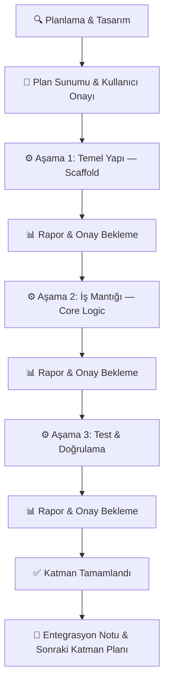

# CLAUDE.md — SeeFps Proje Sistem Talimatları & AI Ajan Kuralları

> **Bu dosya, SeeFps projesinde çalışan tüm AI ajanlarının (Gemini, Claude, Copilot vb.)
> uyması gereken kesin mimari kuralları, teknoloji kısıtlamalarını, proje bağlamını
> ve geliştirme protokolünü tanımlar.**
>
> **Bu dosyayı okuyan her AI ajanı, buradaki tüm kurallara istisnasız uyacaktır.**

---

## 1. Proje Kimliği

| Alan              | Değer                                                             |
| ----------------- | ----------------------------------------------------------------- |
| **Proje Adı**     | SeeFps                                                            |
| **Tür**           | End-to-End Web Uygulaması & Hardware Detection Aracı              |
| **Amaç**          | Kullanıcının donanım ve oyun bilgilerini girerek sanal benchmark simülasyonu çalıştırması ve tahmini FPS, sıcaklık, RPM, clock gibi performans metriklerini görmesi. |
| **Hedef Platform** | Modern web tarayıcıları (Desktop-first, responsive)              |
| **Dil Politikası** | Türkçe (UI & dokümantasyon), İngilizce (kod, commit mesajları, değişken isimleri) |

---

## 2. Teknoloji Yığını (Tech Stack)

> [!CAUTION]
> Aşağıdaki tablo **projenin resmi teknoloji sınırlarını** belirler.
> Bu liste dışında hiçbir framework, kütüphane veya araç kullanıcı onayı olmadan eklenemez.

| Katman                    | Teknoloji                                    | Kullanım Amacı                                        |
| ------------------------- | -------------------------------------------- | ----------------------------------------------------- |
| **Frontend (UI)**         | HTML / CSS / JavaScript (veya React)         | Kullanıcı arayüzü, animasyonlar, SPA deneyimi         |
| **Backend & API**         | Python + **FastAPI**                         | REST API, hızlı veri iletimi, ML model servisi         |
| **Makine Öğrenmesi (ML)** | Python, **Scikit-learn**, **Joblib**         | MLPRegressor inference, pipeline yükleme/çalıştırma    |
| **Detection App**         | Python (**psutil**, **GPUtil**, **cpuinfo**) veya Electron / C# | Kullanıcının yerel donanım bilgilerini tarama |
| **Veri Formatı**          | JSON (API iletişimi), CSV (veri setleri)     | Katmanlar arası veri alışverişi                        |

### 2.1. İzin Verilen Yardımcı Araçlar

Aşağıdaki araçlar, yukarıdaki ana stack'e destek amacıyla kullanılabilir:

- **uvicorn** — FastAPI ASGI sunucusu
- **pydantic** — FastAPI veri doğrulama (FastAPI ile birlikte gelir)
- **numpy / pandas** — ML pipeline'ın mevcut bağımlılıkları
- **cors middleware** — Frontend-Backend iletişimi için
- **python-dotenv** — Ortam değişkeni yönetimi
- **pytest** — Test framework'ü

> [!WARNING]
> Bu listenin dışındaki herhangi bir kütüphane veya framework eklemek için
> **kullanıcı onayı zorunludur.** AI ajanı kendi başına bağımlılık ekleyemez.

---

## 3. Mevcut Durum ve Varlıklar

### ✅ Tamamlanan Bileşenler

| Dosya / Dizin                       | Açıklama                                               |
| ----------------------------------- | ------------------------------------------------------ |
| `TrainedData/seefps_model.joblib`   | Eğitilmiş MLPRegressor pipeline (R² ≈ 0.9997)         |
| `TrainedData/predict_fps.py`        | Üretime hazır, modüler Python tahmin modülü            |
| `TrainedData/main.ipynb`            | Araştırma & eğitim süreci notebook'u (referans)        |
| `TrainedData/main_merged.csv`       | Birleştirilmiş ana veri seti                           |
| `TrainedData/a.csv`, `b.csv`        | Ham veri setleri                                       |
| Frontend arayüzü                    | Tasarımı hazırlanmış UI katmanı                        |

### 🔲 Yapılması Gerekenler

- [ ] Backend API katmanı (FastAPI — sıfırdan kurulacak)
- [ ] ML Model servis entegrasyonu (predict_fps.py → FastAPI endpoint)
- [ ] Detection App (donanım otomatik algılama aracı)
- [ ] Frontend ↔ Backend entegrasyonu
- [ ] Sanal benchmark simülasyon motoru
- [ ] End-to-End test & deployment pipeline

---

## 4. Uygulama Akışı (Kullanıcı Deneyimi)

```
┌─────────────────────────────────────────────────────────┐
│                   1. SPLASH SCREEN                      │
│         Logolarla süslenmiş karşılama ekranı            │
└──────────────────────┬──────────────────────────────────┘
                       │
                       ▼
┌─────────────────────────────────────────────────────────┐
│              2. SİSTEM BİLGİSİ GİRDİSİ                 │
│                                                         │
│  ┌─────────────────┐   ┌─────────────────────────────┐  │
│  │  Detection App  │   │    Manuel Seçim Barları     │  │
│  │  (Otomatik HW   │   │  CPU / GPU / RAM / SSD /   │  │
│  │   Algılama)     │   │  Çözünürlük (Dropdown'lar) │  │
│  └─────────────────┘   └─────────────────────────────┘  │
└──────────────────────┬──────────────────────────────────┘
                       │
                       ▼
┌─────────────────────────────────────────────────────────┐
│            3. OYUN VE HARİTA SEÇİMİ                    │
│     Platform → Oyun → Harita seçimi                     │
└──────────────────────┬──────────────────────────────────┘
                       │
                       ▼
┌─────────────────────────────────────────────────────────┐
│        4. SANAL BENCHMARK SİMÜLASYONU                   │
│  Oyun motoru dinamiklerine dayalı mantıksal test:       │
│  Smoke, yetenekler, yansımalar, partikül efektleri...   │
│  (Arka planda otomatik — kullanıcı müdahalesi yok)      │
└──────────────────────┬──────────────────────────────────┘
                       │
                       ▼
┌─────────────────────────────────────────────────────────┐
│              5. SONUÇLAR (RESULTS)                       │
│                                                         │
│  ┌──────────┐ ┌──────────┐ ┌──────────┐                │
│  │ Max FPS  │ │ Min FPS  │ │ Avg FPS  │                │
│  └──────────┘ └──────────┘ └──────────┘                │
│  ┌──────────────────┐ ┌──────────────────┐              │
│  │ CPU/GPU Sıcaklık │ │ RPM & Clock Hız  │              │
│  └──────────────────┘ └──────────────────┘              │
└──────────────────────┬──────────────────────────────────┘
                       │
                       ▼
              🔄 Yeniden Test → Adım 2'ye dön
```

---

## 5. Mimari Katmanlar

```
┌──────────────────────────────────────────────────────────┐
│                  FRONTEND (UI LAYER)                     │
│          HTML / CSS / JS (veya React)                    │
│     Splash, Formlar, Animasyonlar, Sonuç Ekranı         │
├──────────────────────────────────────────────────────────┤
│                BACKEND API (SERVICE LAYER)                │
│              Python + FastAPI + Uvicorn                   │
│     REST Endpoint'ler, iş mantığı, veri doğrulama        │
├──────────────────────────────────────────────────────────┤
│             ML MODEL ENTEGRASYONu (ML LAYER)             │
│          Scikit-learn + Joblib + predict_fps.py           │
│     Model yükleme, feature engineering, inference        │
├──────────────────────────────────────────────────────────┤
│              DETECTION APP (SYSTEM LAYER)                 │
│        Python (psutil, GPUtil, cpuinfo) veya             │
│        Electron / C# — Donanım otomatik algılama         │
└──────────────────────────────────────────────────────────┘
```

---

## 6. KESİN KURALLAR (STRICT RULES)

> [!CAUTION]
> Aşağıdaki kurallar **mutlak ve ihlal edilemez** kurallardır.
> Bu kurallardan herhangi birini atlayan, görmezden gelen veya dolaylı olarak
> ihlal eden AI davranışı **kabul edilemez** ve derhal düzeltilmelidir.

---

### KURAL 1 — İzole Katman Geliştirme

```
⛔ STRICT RULE: Her bir mimari katman (Frontend, Backend API, ML Model
Entegrasyonu, Detection App) üzerinde kesinlikle AYRI AYRI çalışılacaktır.

• Hiçbir koşulda iki farklı katman aynı anda geliştirilmeyecektir.
• Bir katmandaki çalışma bitirilmeden ve kullanıcı onayı alınmadan
  diğer katmana geçilmeyecektir.
• Her katman bağımsız olarak çalıştırılabilir (test edilebilir) olmalıdır.
```

---

### KURAL 2 — Teknoloji Yığını Kısıtlaması

```
⛔ STRICT RULE: Belirtilen Teknoloji Yığını (Tech Stack — Bölüm 2)
dışına çıkılmayacak, gereksiz kütüphane eklenmeyecektir.

• Frontend: HTML/CSS/JS veya React. Başka UI framework'ü KULLANILMAZ.
• Backend:  Python + FastAPI. Django, Flask veya başka framework KULLANILMAZ.
• ML:       Scikit-learn + Joblib. PyTorch, TensorFlow vb. KULLANILMAZ.
• Detection: psutil, GPUtil, cpuinfo veya Electron/C#.
• Bölüm 2.1'deki yardımcı araçlar listesi dışındaki her bağımlılık için
  kullanıcıdan AÇIK ONAY alınacaktır.
• Gerekçesiz npm install, pip install veya bağımlılık ekleme YAPILMAZ.
```

---

### KURAL 3 — Aşamalı İlerleme (Staged Development)

```
⛔ STRICT RULE: Her mimari katman kendi içinde aşamalara (stages)
bölünecektir.

• Aşamalar açıkça tanımlanacak ve numaralandırılacaktır.
• Her aşamanın kapsamı ve beklenen çıktıları kullanıcıya sunulacaktır.
• Bir aşama tamamlanmadan ve onaylanmadan bir sonraki aşamaya
  geçilmeyecektir.
• Aşama atlama, birleştirme veya paralel çalıştırma YAPILMAZ.
```

---

### KURAL 4 — Zorunlu Durma ve Onay Bekleme

```
⛔ STRICT RULE: AI, her bir adımı bitirdiğinde İŞLEMİ DURDURACAK,
kullanıcıya durumu raporlayacak ve ONAY BEKLEYECEKTİR.

Kullanıcı onayı olmadan asla bir sonraki adıma veya servise
geçilmeyecektir. Her durma noktasında şunlar sunulacaktır:

  1. ✅ Yapılan işin özeti
  2. 📁 Oluşturulan / değiştirilen dosya listesi
  3. 🔜 Bir sonraki adımın kısa planı
  4. ❓ Açık ve net bir "Devam edeyim mi?" sorusu
```

---

### KURAL 5 — End-to-End Bütünlük

```
⛔ STRICT RULE: Bu bir End-to-End projedir. Bütünsellik korunacak
ancak geliştirme izole adımlarla yapılacaktır.

• Her katman bağımsız çalışabilir (loosely coupled) olmalıdır.
• Entegrasyon noktaları (API kontratları, veri formatları, interface
  tanımları) en baştan planlanmalıdır.
• Tüm katmanlar arasında veri formatı ve API sözleşmesi tutarlı
  olmalıdır.
• Katmanlar arası iletişim yalnızca tanımlanmış API endpoint'leri
  ve JSON formatı üzerinden gerçekleşecektir.
```

---

### KURAL 6 — Mevcut Varlıklara Dokunma Yasağı

```
⛔ STRICT RULE: TrainedData/ klasöründeki mevcut dosyalar
(seefps_model.joblib, predict_fps.py, veri setleri, main.ipynb)
doğrudan DEĞİŞTİRİLMEYECEKTİR.

• Bu dosyalar referans ve entegrasyon kaynağıdır.
• ML modeli backend'e entegre edilirken wrapper/adapter pattern
  kullanılacaktır.
• Herhangi bir modifikasyona ihtiyaç duyulursa, değişiklik ÖNCESİ
  kullanıcı onayı ZORUNLUDUR.
```

---

### KURAL 7 — Kod Kalitesi Standartları

```
⛔ STRICT RULE: Üretilen her kod parçası aşağıdaki standartlara
uyacaktır:

  • Açıklayıcı değişken ve fonksiyon isimleri (İngilizce).
  • Her fonksiyon ve modül için docstring.
  • Her mimari kararın yanına kısa yorum satırı.
  • Hata yönetimi (error handling) her katmanda uygulanacak.
  • Güvenlik en iyi pratikleri (input validation, sanitization).
  • DRY (Don't Repeat Yourself) prensibi gözetilecek.
  • Type hints kullanılacak (Python kodlarında).
```

---

## 7. Geliştirme Protokolü

### 7.1. İş Akışı (Her Katman İçin)



### 7.2. Geliştirme Sırası (Önerilen)

| Sıra | Katman                     | Teknoloji                      | Açıklama                                         |
| ---- | -------------------------- | ------------------------------ | ------------------------------------------------ |
| 1    | **Backend API**            | Python + FastAPI               | REST API iskeleti, endpoint tanımları              |
| 2    | **ML Model Entegrasyonu**  | Scikit-learn + Joblib          | `predict_fps.py`'yi FastAPI endpoint'e bağla       |
| 3    | **Detection App**          | psutil / GPUtil / cpuinfo      | Donanım otomatik algılama modülü                   |
| 4    | **Frontend Entegrasyonu**  | HTML/CSS/JS veya React         | Mevcut UI'ı backend API'lara bağla                 |
| 5    | **End-to-End Test**        | pytest + manuel test           | Tüm akışın uçtan uca doğrulanması                  |

> [!IMPORTANT]
> Bu sıralama önerilen yaklaşımdır. Kullanıcı farklı bir sıralama talep ederse,
> o sıraya uyulacaktır.

### 7.3. Commit ve Versiyon Kuralları

- Commit mesajları **İngilizce** ve açıklayıcı olacak.
- Her aşama tamamlandığında bir commit atılacak.
- Branch stratejisi: `feature/<katman-adı>/<aşama-numarası>` formatı önerilir.
- Örnek: `feature/backend-api/stage-1-scaffold`

---

## 8. Teknik Detaylar

### 8.1. ML Pipeline Özeti

| Bileşen                | Detay                                                                |
| ----------------------- | -------------------------------------------------------------------- |
| **Model**               | `MLPRegressor` (scikit-learn)                                        |
| **Pipeline**            | `SimpleImputer → StandardScaler / OrdinalEncoder / OneHotEncoder (ColumnTransformer) → MLPRegressor` |
| **Feature Engineering** | 14 mühendislik özniteliği (ratio, proxy, efficiency skoru)           |
| **Performans**          | R² ≈ 0.9997                                                         |
| **Artefakt Formatı**    | `joblib` → `{ pipeline: Pipeline, numeric_cols: list }` dict         |
| **Yüksek Kardinalite**  | `cpuname` ve `gpuname` model girişinden çıkarılıyor, lookup için kullanılıyor |

### 8.2. FastAPI Backend Tasarım İlkeleri

- RESTful endpoint yapısı.
- JSON request/response formatı.
- Pydantic modelleri ile input validation.
- Anlamlı HTTP status kodları (200, 400, 404, 422, 500).
- CORS middleware — frontend ihtiyaçlarına göre.
- Hata mesajları kullanıcı dostu ama hassas bilgi sızdırmayan formatta.

### 8.3. Planlanan API Endpoint'leri (Taslak)

```
GET  /api/health                → Sunucu sağlık kontrolü
POST /api/predict               → FPS tahmin isteği
GET  /api/games                 → Desteklenen oyun listesi
GET  /api/hardware/cpus         → Veritabanındaki CPU listesi
GET  /api/hardware/gpus         → Veritabanındaki GPU listesi
POST /api/detect                → Detection App sonuçlarını alma
```

> [!NOTE]
> Bu endpoint listesi taslaktır ve Backend API katmanı planlanırken
> kullanıcı ile birlikte kesinleştirilecektir.

### 8.4. Güvenlik Kuralları

- Kullanıcı girdileri her zaman sanitize edilecek.
- FastAPI Pydantic modelleri ile otomatik input validation.
- Hata mesajları hassas bilgi sızdırmayacak (stack trace vb. prod'da kapalı).
- `.env` dosyaları `.gitignore`'a eklenecek.
- CORS origin'leri production'da kısıtlanacak.

---

## 9. Hedef Dosya Yapısı (Şablon)

```
SeeFps/
├── CLAUDE.md                        # ← Bu dosya (proje kuralları)
├── README.md                        # Proje açıklaması
├── .gitignore
├── .env.example                     # Ortam değişkenleri şablonu
│
├── TrainedData/                     # 🔒 MEVCUT — DOKUNULMAYACAK
│   ├── seefps_model.joblib          #    Eğitilmiş ML modeli
│   ├── predict_fps.py               #    Tahmin betiği
│   ├── main.ipynb                   #    Araştırma notebook'u
│   ├── main_merged.csv              #    Birleştirilmiş veri seti
│   ├── a.csv                        #    Ham veri seti A
│   └── b.csv                        #    Ham veri seti B
│
├── backend/                         # 🔲 KURULACAK — FastAPI
│   ├── main.py                      #    FastAPI uygulama giriş noktası
│   ├── requirements.txt             #    Python bağımlılıkları
│   ├── .env                         #    Ortam değişkenleri (gitignore)
│   ├── config/
│   │   └── settings.py              #    Uygulama ayarları
│   ├── routers/
│   │   ├── predict.py               #    /api/predict endpoint'i
│   │   ├── games.py                 #    /api/games endpoint'i
│   │   └── hardware.py              #    /api/hardware endpoint'leri
│   ├── services/
│   │   ├── ml_service.py            #    ML model wrapper/adapter
│   │   └── benchmark_service.py     #    Sanal benchmark simülasyonu
│   ├── models/
│   │   └── schemas.py               #    Pydantic request/response modelleri
│   ├── utils/
│   │   └── helpers.py               #    Yardımcı fonksiyonlar
│   └── tests/
│       └── test_predict.py          #    Birim testleri
│
├── frontend/                        # 🔲 ENTEGRE EDİLECEK
│   ├── index.html                   #    Ana sayfa
│   ├── css/
│   │   └── style.css                #    Stil dosyası
│   ├── js/
│   │   └── app.js                   #    Uygulama mantığı
│   └── assets/
│       ├── images/                  #    Görseller
│       └── fonts/                   #    Yazı tipleri
│
└── detection/                       # 🔲 KURULACAK
    ├── detector.py                  #    Donanım algılama betiği
    ├── requirements.txt             #    Bağımlılıklar
    └── tests/
        └── test_detector.py         #    Birim testleri
```

> [!NOTE]
> Bu yapı bir hedef şablondur. Her katmanın planlaması sırasında
> kullanıcı ile birlikte kesinleştirilecektir.

---

## 10. AI Ajan Davranış Kuralları

| #  | Kural                            | Açıklama                                                               |
| -- | -------------------------------- | ---------------------------------------------------------------------- |
| 1  | **Türkçe iletişim**              | Kullanıcı ile diyalog daima Türkçe. Kod ve commit mesajları İngilizce. |
| 2  | **Varsayımda bulunma**           | Belirsiz bir durum varsa tahmin etme, kullanıcıya sor.                 |
| 3  | **Kapsamı aşma**                 | İstenmeyen ekstra özellik, kütüphane veya framework ekleme.            |
| 4  | **Her değişikliği açıkla**       | Ne yaptığını, neden yaptığını kullanıcıya raporla.                     |
| 5  | **Test yaz**                     | Mümkün olan her katmanda birim testi oluştur.                          |
| 6  | **Hata durumunda dur**           | Hata ile karşılaşıldığında sessizce geçme, kullanıcıya bildir.        |
| 7  | **Plan sun**                     | Her yeni katmana başlamadan önce implementation plan oluştur ve onay al.|
| 8  | **Tech stack'e sadık kal**       | Bölüm 2'deki listeye kesinlikle uy. İstisna için kullanıcı onayı al.  |
| 9  | **Küçük adımlar at**             | Büyük monolitik değişiklikler yerine küçük, gözden geçirilebilir adımlar.|
| 10 | **Mevcut dosyaları koru**        | `TrainedData/` içeriğini değiştirme, wrapper/adapter pattern kullan.   |

---

## 11. İletişim Şablonu (Her Adım Sonrası)

AI ajanı her adımı tamamladığında aşağıdaki formatta rapor verecektir:

```markdown
## ✅ [Katman Adı] — Aşama [N] Tamamlandı: [Aşama Başlığı]

### 📋 Yapılan İşler
- [İş 1]
- [İş 2]
- [İş 3]

### 📁 Oluşturulan / Değiştirilen Dosyalar
| Dosya                      | İşlem     | Açıklama            |
| -------------------------- | --------- | ------------------- |
| `backend/main.py`          | Oluşturma | FastAPI giriş noktası |
| `backend/requirements.txt` | Oluşturma | Bağımlılık listesi  |

### 🔜 Bir Sonraki Adım
[Sonraki aşamanın kısa açıklaması ve kapsamı]

### ❓ Devam Onayı
Yukarıdaki işlemler tamamlandı.
**Bir sonraki aşamaya geçmemi onaylıyor musunuz?**
```

---

## 12. Katmanlar Arası Entegrasyon Sözleşmesi

### 12.1. Frontend → Backend API

```json
// POST /api/predict — Request Body
{
  "cpu_name": "string",
  "gpu_name": "string",
  "game_name": "string",
  "game_resolution": 1080.0,
  "game_setting": "max"
}

// POST /api/predict — Response Body
{
  "success": true,
  "data": {
    "avg_fps": 144.5,
    "max_fps": 180.2,
    "min_fps": 98.7,
    "cpu_temp": 72,
    "gpu_temp": 68,
    "cpu_clock": 4200,
    "gpu_clock": 1800,
    "fan_rpm": 1450
  }
}
```

### 12.2. Detection App → Frontend

```json
// Detection Result Format
{
  "cpu_name": "Intel Core i9-9900K",
  "gpu_name": "NVIDIA RTX 2080 Ti",
  "ram_total_gb": 32,
  "ssd_model": "Samsung 970 EVO",
  "os": "Windows 10",
  "resolution": "1920x1080"
}
```

> [!IMPORTANT]
> Bu veri sözleşmeleri taslaktır. Backend API katmanı planlanırken
> kesin şema kullanıcı ile birlikte onaylanacaktır.

---

> **Son Güncelleme:** 2026-06-16
> **Versiyon:** 2.0.0
> **Hazırlayan:** AI Mimari Asistanı
