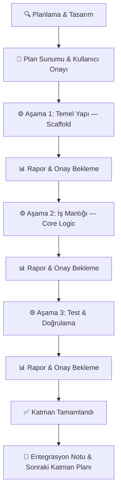

# CLAUDE.md — SeeFps Proje Sistem Talimatları & AI Ajan Kuralları

> **Bu dosya, SeeFps projesinde çalışan tüm AI ajanlarının (Gemini, Claude, Copilot vb.)
> uyması gereken kesin mimari kuralları, teknoloji kısıtlamalarını, proje bağlamını
> ve geliştirme protokolünü tanımlar.**
>
> **Bu dosyayı okuyan her AI ajanı, buradaki tüm kurallara istisnasız uyacaktır.**

---

## 1. Proje Kimliği

| Alan               | Değer                                                                       |
| ------------------ | --------------------------------------------------------------------------- |
| **Proje Adı**      | SeeFps                                                                      |
| **Tür**            | End-to-End Web Platformu + Masaüstü İstemcileri (Hub & Spoke Mimari)        |
| **Amaç**           | Kullanıcının donanım bilgilerini otomatik veya manuel alarak, masaüstü simülasyon uygulaması üzerinden sanal benchmark çalıştırıp tahmini FPS, sıcaklık, RPM ve clock metriklerini web platformunda görmesi. |
| **Mimari Model**   | **Hub & Spoke** — Web Platformu (Hub) + Detection App (Spoke) + Simulation App (Spoke) |
| **Hedef Platform** | Web: Modern tarayıcılar (Desktop-first) · Masaüstü: Windows (öncelik), macOS/Linux (opsiyonel) |
| **Dil Politikası** | Türkçe (UI & dokümantasyon), İngilizce (kod, commit mesajları, değişken isimleri) |

---

## 2. Teknoloji Yığını (Tech Stack)

> [!CAUTION]
> Aşağıdaki tablo **projenin resmi teknoloji sınırlarını** belirler.
> Bu liste dışında hiçbir framework, kütüphane veya araç kullanıcı onayı olmadan eklenemez.

| Katman                          | Teknoloji                                    | Kullanım Amacı                                           |
| ------------------------------- | -------------------------------------------- | -------------------------------------------------------- |
| **Frontend (UI — Web Hub)**     | HTML / CSS / JavaScript (veya React)         | Kullanıcı arayüzü, Selection Box'lar, Analyzing state, sonuç ekranı |
| **Backend & API (Hub Core)**    | Python + **FastAPI**                         | REST API + WebSocket, veri servisi, ML proxy, session yönetimi |
| **Makine Öğrenmesi (ML)**       | Python, **Scikit-learn**, **Joblib**         | MLPRegressor inference, pipeline yükleme/çalıştırma       |
| **Detection App (Spoke 1)**     | Python (**psutil**, **GPUtil**, **cpuinfo**) veya Electron / C# | Kullanıcının yerel donanım bilgilerini tarayıp API'ye gönderme |
| **Simulation App (Spoke 2)**    | Python (veya Electron / C#)                  | Masaüstünde sanal benchmark simülasyonu çalıştırıp sonuçları API'ye gönderme |
| **Veri Formatı**                | JSON (API iletişimi), CSV (veri setleri)     | Katmanlar arası veri alışverişi                           |

### 2.1. İzin Verilen Yardımcı Araçlar

Aşağıdaki araçlar, yukarıdaki ana stack'e destek amacıyla kullanılabilir:

- **uvicorn** — FastAPI ASGI sunucusu
- **pydantic** — FastAPI veri doğrulama (FastAPI ile birlikte gelir)
- **numpy / pandas** — ML pipeline'ın mevcut bağımlılıkları
- **cors middleware** — Frontend-Backend iletişimi için
- **websockets** — Simulation App ↔ Backend gerçek zamanlı iletişim
- **python-dotenv** — Ortam değişkeni yönetimi
- **pytest** — Test framework'ü

> [!WARNING]
> Bu listenin dışındaki herhangi bir kütüphane veya framework eklemek için
> **kullanıcı onayı zorunludur.** AI ajanı kendi başına bağımlılık ekleyemez.

---

## 3. Mevcut Durum ve Varlıklar

### ✅ Tamamlanan Bileşenler

| Dosya / Dizin                       | Açıklama                                               |
| ----------------------------------- | ------------------------------------------------------ |
| `TrainedData/seefps_model.joblib`   | Eğitilmiş MLPRegressor pipeline (R² ≈ 0.9997)         |
| `TrainedData/predict_fps.py`        | Üretime hazır, modüler Python tahmin modülü            |
| `TrainedData/main.ipynb`            | Araştırma & eğitim süreci notebook'u (referans)        |
| `TrainedData/main_merged.csv`       | Birleştirilmiş ana veri seti                           |
| `TrainedData/a.csv`, `b.csv`        | Ham veri setleri                                       |
| Frontend arayüzü                    | Lovable ile üretilmiş UI (refactor edilecek)           |

### 🔲 Yapılması Gerekenler

- [ ] Frontend refactoring (Mock data temizliği, Selection Box'lar, Analyzing state)
- [ ] Backend API katmanı (FastAPI — sıfırdan kurulacak)
- [ ] ML Model servis entegrasyonu (predict_fps.py → FastAPI endpoint)
- [ ] Detection App — masaüstü donanım tarama istemcisi
- [ ] Simulation App — masaüstü benchmark simülasyon istemcisi
- [ ] Frontend ↔ Backend entegrasyonu
- [ ] Masaüstü İstemcileri ↔ Backend entegrasyonu
- [ ] End-to-End test & deployment pipeline

---

## 4. Hub & Spoke Mimari Model

```
                    ┌───────────────────────────────────┐
                    │         🌐 WEB PLATFORM (HUB)     │
                    │                                   │
                    │  ┌─────────────────────────────┐  │
                    │  │       FRONTEND (UI)          │  │
                    │  │  Selection Box'lar (Dropdown) │  │
                    │  │  Analyzing State Ekranı       │  │
                    │  │  Sonuç (Results) Dashboard    │  │
                    │  └──────────┬──────────────────┘  │
                    │             │ REST API             │
                    │  ┌──────────▼──────────────────┐  │
                    │  │     BACKEND API (FastAPI)    │  │
                    │  │  ML Servisi • Veri Servisi   │  │
                    │  │  WebSocket • Session Yönetim │  │
                    │  └──┬────────────────────┬────┘  │
                    └─────┼────────────────────┼───────┘
                          │                    │
              ┌───────────▼──────┐  ┌──────────▼────────────┐
              │  🔍 DETECTION    │  │  🎮 SIMULATION APP    │
              │     APP          │  │  (Masaüstü İstemci)   │
              │  (Masaüstü)      │  │                       │
              │                  │  │  ML Model Inference   │
              │  POST /api/detect│  │  Benchmark Motoru     │
              │  HW bilgilerini  │  │  Sonuçları POST ile   │
              │  API'ye gönderir │  │  API'ye gönderir      │
              │  (Spoke 1)       │  │  (Spoke 2)            │
              └──────────────────┘  └───────────────────────┘
```

> [!IMPORTANT]
> **Simülasyon tarayıcıda ÇALIŞMAZ.** Benchmark simülasyonu kullanıcının bilgisayarına
> indirilen ayrı bir **Desktop Simulation App** tarafından yürütülür. Sonuçlar API
> aracılığıyla web platformuna geri gönderilir. Web sitesinde simülasyon süresince
> bir **"Analyzing..." bekleme ekranı** gösterilir.

---

## 5. Uygulama Akışı (Kullanıcı Deneyimi)

```
┌─────────────────────────────────────────────────────────┐
│                   1. SPLASH SCREEN                      │
│         Logolarla süslenmiş karşılama ekranı            │
└──────────────────────┬──────────────────────────────────┘
                       │
                       ▼
┌─────────────────────────────────────────────────────────┐
│              2. SİSTEM BİLGİSİ GİRDİSİ                 │
│                                                         │
│  ┌─────────────────┐   ┌─────────────────────────────┐  │
│  │  Detection App  │   │   Manuel Selection Box'lar  │  │
│  │  (Masaüstü —    │   │  ┌───────────────────────┐  │  │
│  │   Otomatik HW   │   │  │ CPU Dropdown     ▼  │  │  │
│  │   Tarama)       │   │  │ GPU Dropdown     ▼  │  │  │
│  │       │         │   │  │ RAM Dropdown     ▼  │  │  │
│  │       ▼         │   │  │ SSD Dropdown     ▼  │  │  │
│  │  POST /api/     │   │  │ Çözünürlük       ▼  │  │  │
│  │  detect         │   │  └───────────────────────┘  │  │
│  └─────────────────┘   └─────────────────────────────┘  │
│                                                         │
│  ⚠️  Tüm veriler ML dataset'inden beslenir.             │
│     Mock data KULLANILMAZ.                              │
└──────────────────────┬──────────────────────────────────┘
                       │
                       ▼
┌─────────────────────────────────────────────────────────┐
│            3. OYUN VE HARİTA SEÇİMİ                    │
│     Platform → Oyun → Harita selection box               │
└──────────────────────┬──────────────────────────────────┘
                       │
                       ▼
┌─────────────────────────────────────────────────────────┐
│        4. MASAÜSTÜ BENCHMARK SİMÜLASYONU                │
│                                                         │
│  ┌─────────────────────────────────────────────────┐    │
│  │  💻 Simulation App (Masaüstü İstemci)            │    │
│  │  • Kullanıcının bilgisayarına indirilir           │    │
│  │  • Arka planda sanal benchmark koşturur           │    │
│  │  • Oyun motoru dinamikleri: smoke, yetenekler,    │    │
│  │    yansımalar, partikül efektleri simüle edilir    │    │
│  │  • Sonuçları API'ye POST eder                     │    │
│  └─────────────────────────────────────────────────┘    │
│                                                         │
│  ┌─────────────────────────────────────────────────┐    │
│  │  🌐 Web Sitesi — "Analyzing..." Bekleme Ekranı   │    │
│  │  • İlerleme çubuğu / aşama gösterimi              │    │
│  │  • "GPU yük testi...", "Sonuçlar hesaplanıyor..." │    │
│  │  • WebSocket ile canlı durum güncellemesi          │    │
│  └─────────────────────────────────────────────────┘    │
└──────────────────────┬──────────────────────────────────┘
                       │
                       ▼
┌─────────────────────────────────────────────────────────┐
│              5. SONUÇLAR (RESULTS)                       │
│                                                         │
│  ┌──────────┐ ┌──────────┐ ┌──────────┐                │
│  │ Max FPS  │ │ Min FPS  │ │ Avg FPS  │                │
│  └──────────┘ └──────────┘ └──────────┘                │
│  ┌──────────────────┐ ┌──────────────────┐              │
│  │ CPU/GPU Sıcaklık │ │ RPM & Clock Hız  │              │
│  └──────────────────┘ └──────────────────┘              │
│  ┌──────────────────────────────────────┐               │
│  │ Darboğaz Analizi (Bottleneck)        │               │
│  └──────────────────────────────────────┘               │
└──────────────────────┬──────────────────────────────────┘
                       │
                       ▼
              🔄 Yeniden Test → Adım 2'ye dön
```

---

## 6. KESİN KURALLAR (STRICT RULES)

> [!CAUTION]
> Aşağıdaki kurallar **mutlak ve ihlal edilemez** kurallardır.
> Bu kurallardan herhangi birini atlayan, görmezden gelen veya dolaylı olarak
> ihlal eden AI davranışı **kabul edilemez** ve derhal düzeltilmelidir.

---

### KURAL 1 — İzole Katman Geliştirme

```
⛔ STRICT RULE: Her bir mimari katman (Frontend, Backend API, ML Model
Entegrasyonu, Detection App, Simulation App) üzerinde kesinlikle AYRI
AYRI çalışılacaktır.

• Hiçbir koşulda iki farklı katman aynı anda geliştirilmeyecektir.
• Bir katmandaki çalışma bitirilmeden ve kullanıcı onayı alınmadan
  diğer katmana geçilmeyecektir.
• Her katman bağımsız olarak çalıştırılabilir (test edilebilir) olmalıdır.
```

---

### KURAL 2 — Teknoloji Yığını Kısıtlaması

```
⛔ STRICT RULE: Belirtilen Teknoloji Yığını (Tech Stack — Bölüm 2)
dışına çıkılmayacak, gereksiz kütüphane eklenmeyecektir.

• Frontend: HTML/CSS/JS veya React. Başka UI framework'ü KULLANILMAZ.
• Backend:  Python + FastAPI. Django, Flask veya başka framework KULLANILMAZ.
• ML:       Scikit-learn + Joblib. PyTorch, TensorFlow vb. KULLANILMAZ.
• Detection App: psutil, GPUtil, cpuinfo veya Electron/C#.
• Simulation App: Python veya Electron/C#.
• Bölüm 2.1'deki yardımcı araçlar listesi dışındaki her bağımlılık için
  kullanıcıdan AÇIK ONAY alınacaktır.
• Gerekçesiz npm install, pip install veya bağımlılık ekleme YAPILMAZ.
```

---

### KURAL 3 — Aşamalı İlerleme (Staged Development)

```
⛔ STRICT RULE: Her mimari katman kendi içinde aşamalara (stages)
bölünecektir.

• Aşamalar açıkça tanımlanacak ve numaralandırılacaktır.
• Her aşamanın kapsamı ve beklenen çıktıları kullanıcıya sunulacaktır.
• Bir aşama tamamlanmadan ve onaylanmadan bir sonraki aşamaya
  geçilmeyecektir.
• Aşama atlama, birleştirme veya paralel çalıştırma YAPILMAZ.
```

---

### KURAL 4 — Zorunlu Durma ve Onay Bekleme

```
⛔ STRICT RULE: AI, her bir adımı bitirdiğinde İŞLEMİ DURDURACAK,
kullanıcıya durumu raporlayacak ve ONAY BEKLEYECEKTİR.

Kullanıcı onayı olmadan asla bir sonraki adıma veya servise
geçilmeyecektir. Her durma noktasında şunlar sunulacaktır:

  1. ✅ Yapılan işin özeti
  2. 📁 Oluşturulan / değiştirilen dosya listesi
  3. 🔜 Bir sonraki adımın kısa planı
  4. ❓ Açık ve net bir "Devam edeyim mi?" sorusu
```

---

### KURAL 5 — End-to-End Bütünlük (Hub & Spoke)

```
⛔ STRICT RULE: Bu bir Hub & Spoke mimarisinde End-to-End projedir.
Bütünsellik korunacak ancak geliştirme izole adımlarla yapılacaktır.

• Web Platformu (Hub) tüm veri akışının merkez noktasıdır.
• Masaüstü istemcileri (Spoke) yalnızca tanımlanmış API endpoint'leri
  üzerinden Hub ile iletişim kurar.
• Entegrasyon noktaları (API kontratları, veri formatları, WebSocket
  protokolleri) en baştan planlanmalıdır.
• Tüm katmanlar arasında veri formatı ve API sözleşmesi tutarlı
  olmalıdır.
```

---

### KURAL 6 — Mevcut Varlıklara Dokunma Yasağı

```
⛔ STRICT RULE: TrainedData/ klasöründeki mevcut dosyalar
(seefps_model.joblib, predict_fps.py, veri setleri, main.ipynb)
doğrudan DEĞİŞTİRİLMEYECEKTİR.

• Bu dosyalar referans ve entegrasyon kaynağıdır.
• ML modeli backend veya Simulation App'e entegre edilirken
  wrapper/adapter pattern kullanılacaktır.
• Herhangi bir modifikasyona ihtiyaç duyulursa, değişiklik ÖNCESİ
  kullanıcı onayı ZORUNLUDUR.
```

---

### KURAL 7 — Mock Data Yasağı

```
⛔ STRICT RULE: Sistemde hiçbir yerde MOCK DATA (sahte/statik veri)
kullanılmayacaktır.

• Frontend'teki tüm Selection Box'lar (Dropdown), Backend API
  üzerinden eğitilmiş ML veri setinden (dataset) beslenecektir.
• Hardcoded listeler, sahte JSON dosyaları veya placeholder veriler
  KESİNLİKLE YASAKTIR.
• Geliştirme/test sırasında geçici mock data gerekirse, bu açıkça
  "// TODO: MOCK — API bağlantısında kaldırılacak" ile işaretlenmeli
  ve kullanıcıya bildirilmelidir.
• Nihai üründe hiçbir mock data kalıntısı bulunmayacaktır.
```

---

### KURAL 8 — Simülasyon Yeri Kısıtlaması

```
⛔ STRICT RULE: Benchmark simülasyonu tarayıcıda (browser içinde)
ÇALIŞTIRILMAYACAKTIR.

• Simülasyon yalnızca kullanıcının bilgisayarına indirilen
  "Desktop Simulation App" tarafından yürütülür.
• Simulation App sonuçları Backend API'ye POST eder.
• Web sitesinde simülasyon süresince "Analyzing..." bekleme
  ekranı gösterilir.
• Frontend'de simülasyon mantığı veya ML inference kodu
  BULUNMAYACAKTIR.
```

---

### KURAL 9 — Kod Kalitesi Standartları

```
⛔ STRICT RULE: Üretilen her kod parçası aşağıdaki standartlara
uyacaktır:

  • Açıklayıcı değişken ve fonksiyon isimleri (İngilizce).
  • Her fonksiyon ve modül için docstring.
  • Her mimari kararın yanına kısa yorum satırı.
  • Hata yönetimi (error handling) her katmanda uygulanacak.
  • Güvenlik en iyi pratikleri (input validation, sanitization).
  • DRY (Don't Repeat Yourself) prensibi gözetilecek.
  • Type hints kullanılacak (Python kodlarında).
```

---

## 7. Geliştirme Protokolü

### 7.1. İş Akışı (Her Katman İçin)



### 7.2. Geliştirme Sırası (Önerilen)

| Sıra | Katman                     | Teknoloji                      | Açıklama                                                     |
| ---- | -------------------------- | ------------------------------ | ------------------------------------------------------------ |
| 1    | **Frontend Refactoring**   | HTML/CSS/JS veya React         | Mock data temizliği, Selection Box'lar, Analyzing state       |
| 2    | **Backend API**            | Python + FastAPI               | REST API + WebSocket, veri servisi, endpoint tanımları         |
| 3    | **ML Model Entegrasyonu**  | Scikit-learn + Joblib          | `predict_fps.py`'yi Backend/Simulation App'e bağla            |
| 4    | **Detection App**          | psutil / GPUtil / cpuinfo      | Masaüstü donanım tarama istemcisi                             |
| 5    | **Simulation App**         | Python veya Electron/C#        | Masaüstü benchmark simülasyon istemcisi                       |
| 6    | **End-to-End Test**        | pytest + manuel test           | Tüm Hub & Spoke akışının uçtan uca doğrulanması              |

> [!IMPORTANT]
> Bu sıralama önerilen yaklaşımdır. Kullanıcı farklı bir sıralama talep ederse,
> o sıraya uyulacaktır.

### 7.3. Commit ve Versiyon Kuralları

- Commit mesajları **İngilizce** ve açıklayıcı olacak.
- Her aşama tamamlandığında bir commit atılacak.
- Branch stratejisi: `feature/<katman-adı>/<aşama-numarası>` formatı önerilir.
- Örnek: `feature/simulation-app/stage-1-scaffold`

---

## 8. Teknik Detaylar

### 8.1. ML Pipeline Özeti

| Bileşen                | Detay                                                                |
| ----------------------- | -------------------------------------------------------------------- |
| **Model**               | `MLPRegressor` (scikit-learn)                                        |
| **Pipeline**            | `SimpleImputer → StandardScaler / OrdinalEncoder / OneHotEncoder (ColumnTransformer) → MLPRegressor` |
| **Feature Engineering** | 14 mühendislik özniteliği (ratio, proxy, efficiency skoru)           |
| **Performans**          | R² ≈ 0.9997                                                         |
| **Artefakt Formatı**    | `joblib` → `{ pipeline: Pipeline, numeric_cols: list }` dict         |
| **Yüksek Kardinalite**  | `cpuname` ve `gpuname` model girişinden çıkarılıyor, lookup için kullanılıyor |

### 8.2. FastAPI Backend Tasarım İlkeleri

- RESTful endpoint yapısı + WebSocket desteği.
- JSON request/response formatı.
- Pydantic modelleri ile input validation.
- Anlamlı HTTP status kodları (200, 400, 404, 422, 500).
- CORS middleware — frontend ihtiyaçlarına göre.
- Hata mesajları kullanıcı dostu ama hassas bilgi sızdırmayan formatta.
- Session/token yönetimi — masaüstü istemcileri ile web arasında bağlam paylaşımı.

### 8.3. Planlanan API Endpoint'leri (Taslak)

> **Giriş Noktası:** `uvicorn server:app --reload --port 8000`
> (`main.py` DEĞİL — çakışmayı önlemek için `server.py` kullanılır)

```
# ─── Veri Servisi (Frontend Dropdown'ları besler — Dataset'ten) ───
GET  /api/health                     → Sunucu sağlık kontrolü
GET  /api/hardware/cpus              → Dataset'ten CPU listesi
GET  /api/hardware/gpus              → Dataset'ten GPU listesi
GET  /api/hardware/rams              → Dataset'ten RAM seçenekleri
GET  /api/hardware/ssds              → Dataset'ten SSD seçenekleri
GET  /api/games                      → Dataset'ten oyun listesi
GET  /api/games/{game_id}/maps       → Oyuna ait harita listesi
GET  /api/resolutions                → Desteklenen çözünürlükler

# ─── Masaüstü İstemci Endpoint'leri ───
POST /api/detect                     → Detection App donanım verisi alma
POST /api/simulation/results         → Simulation App benchmark sonuçları alma

# ─── Gerçek Zamanlı İletişim ───
WS   /ws/simulation/{session_id}     → Frontend'e canlı simülasyon durumu akışı
```

> [!NOTE]
> Bu endpoint listesi taslaktır ve Backend API katmanı planlanırken
> kullanıcı ile birlikte kesinleştirilecektir.

### 8.4. Frontend UI Bileşenleri

| Bileşen                     | Tür             | Açıklama                                              |
| --------------------------- | --------------- | ----------------------------------------------------- |
| **CPU Selection Box**       | Dropdown        | Dataset'ten beslenen, arama destekli açılır kutu       |
| **GPU Selection Box**       | Dropdown        | Dataset'ten beslenen, arama destekli açılır kutu       |
| **RAM Selection Box**       | Dropdown        | Kapasite + frekans seçimi                              |
| **SSD Selection Box**       | Dropdown        | Model / tür seçimi                                    |
| **Çözünürlük Selection Box**| Dropdown        | 720p / 1080p / 1440p / 4K                             |
| **Oyun / Harita Selection** | Dropdown (x2)   | Oyun seçimi → harita seçimi (kaskat)                   |
| **Analyzing State Ekranı**  | Overlay / Modal | Simülasyon sırasında ilerleme çubuğu + aşama metinleri|
| **Results Dashboard**       | Panel           | FPS, sıcaklık, RPM, clock, bottleneck gösterimi       |

> [!IMPORTANT]
> Frontend'te **slider/sürüklemeli yapı KULLANILMAYACAKTIR.**
> Tüm donanım seçimleri Selection Box (Dropdown) ile yapılacaktır.

### 8.5. Güvenlik Kuralları

- Kullanıcı girdileri her zaman sanitize edilecek.
- FastAPI Pydantic modelleri ile otomatik input validation.
- Masaüstü istemci ↔ API iletişiminde kimlik doğrulama (token/session).
- Hata mesajları hassas bilgi sızdırmayacak (stack trace vb. prod'da kapalı).
- `.env` dosyaları `.gitignore`'a eklenecek.
- CORS origin'leri production'da kısıtlanacak.

---

## 9. Hedef Dosya Yapısı (Şablon)

```
SeeFps/
├── CLAUDE.md                        # ← Bu dosya (proje kuralları)
├── README.md                        # Proje açıklaması
├── Roadmap.md                       # Geliştirme yol haritası
├── .gitignore
├── .env.example                     # Ortam değişkenleri şablonu
│
├── TrainedData/                     # 🔒 MEVCUT — DOKUNULMAYACAK
│   ├── seefps_model.joblib          #    Eğitilmiş ML modeli
│   ├── predict_fps.py               #    Tahmin betiği
│   ├── main.ipynb                   #    Araştırma notebook'u
│   ├── main_merged.csv              #    Birleştirilmiş veri seti
│   ├── a.csv                        #    Ham veri seti A
│   └── b.csv                        #    Ham veri seti B
│
├── backend/                         # 🔲 KURULACAK — FastAPI (Hub Core)
│   ├── server.py                    #    ⚠️ FastAPI giriş noktası (main.py DEĞİL)
│   ├── requirements.txt             #    Python bağımlılıkları
│   ├── .env                         #    Ortam değişkenleri (gitignore)
│   ├── config/
│   │   └── settings.py              #    Uygulama ayarları
│   ├── routers/
│   │   ├── predict.py               #    /api/predict endpoint'i
│   │   ├── games.py                 #    /api/games endpoint'i
│   │   ├── hardware.py              #    /api/hardware endpoint'leri
│   │   ├── detection.py             #    /api/detect endpoint'i
│   │   └── simulation.py            #    /api/simulation + WebSocket
│   ├── services/
│   │   ├── ml_service.py            #    predict_fps.py wrapper/adapter (import tahmin_et)
│   │   ├── data_service.py          #    predict_fps.py'den load_and_prepare_data() ile veri erişim
│   │   └── session_service.py       #    Session/token yönetimi
│   ├── models/
│   │   └── schemas.py               #    Pydantic request/response modelleri
│   ├── utils/
│   │   └── helpers.py               #    Yardımcı fonksiyonlar
│   └── tests/
│       └── test_predict.py          #    Birim testleri
│
├── frontend/                        # 🔲 REFACTOR EDİLECEK (Lovable → Production)
│   ├── index.html                   #    Ana sayfa
│   ├── css/
│   │   └── style.css                #    Stil dosyası
│   ├── js/
│   │   ├── app.js                   #    Uygulama mantığı
│   │   └── apiService.js            #    API iletişim katmanı
│   └── assets/
│       ├── images/                  #    Görseller
│       └── fonts/                   #    Yazı tipleri
│
├── detection/                       # 🔲 KURULACAK — Masaüstü İstemci (Spoke 1)
│   ├── detector.py                  #    Donanım algılama betiği
│   ├── api_client.py                #    Backend API iletişim modülü
│   ├── requirements.txt             #    Bağımlılıklar
│   └── tests/
│       └── test_detector.py         #    Birim testleri
│
└── simulation/                      # 🔲 KURULACAK — Masaüstü İstemci (Spoke 2)
    ├── simulator.py                 #    Benchmark simülasyon motoru
    ├── ml_adapter.py                #    ML model wrapper (predict_fps.py adapter)
    ├── api_client.py                #    Backend API iletişim modülü
    ├── requirements.txt             #    Bağımlılıklar
    └── tests/
        └── test_simulator.py        #    Birim testleri
```

> [!NOTE]
> Bu yapı bir hedef şablondur. Her katmanın planlaması sırasında
> kullanıcı ile birlikte kesinleştirilecektir.

---

## 10. AI Ajan Davranış Kuralları

| #  | Kural                            | Açıklama                                                               |
| -- | -------------------------------- | ---------------------------------------------------------------------- |
| 1  | **Türkçe iletişim**              | Kullanıcı ile diyalog daima Türkçe. Kod ve commit mesajları İngilizce. |
| 2  | **Varsayımda bulunma**           | Belirsiz bir durum varsa tahmin etme, kullanıcıya sor.                 |
| 3  | **Kapsamı aşma**                 | İstenmeyen ekstra özellik, kütüphane veya framework ekleme.            |
| 4  | **Her değişikliği açıkla**       | Ne yaptığını, neden yaptığını kullanıcıya raporla.                     |
| 5  | **Test yaz**                     | Mümkün olan her katmanda birim testi oluştur.                          |
| 6  | **Hata durumunda dur**           | Hata ile karşılaşıldığında sessizce geçme, kullanıcıya bildir.        |
| 7  | **Plan sun**                     | Her yeni katmana başlamadan önce implementation plan oluştur ve onay al.|
| 8  | **Tech stack'e sadık kal**       | Bölüm 2'deki listeye kesinlikle uy. İstisna için kullanıcı onayı al.  |
| 9  | **Küçük adımlar at**             | Büyük monolitik değişiklikler yerine küçük, gözden geçirilebilir adımlar.|
| 10 | **Mevcut dosyaları koru**        | `TrainedData/` içeriğini değiştirme, wrapper/adapter pattern kullan.   |
| 11 | **Mock data kullanma**           | Her zaman ML dataset'ten beslen. Sahte veri kesinlikle yasak.          |
| 12 | **Simülasyonu tarayıcıya koyma** | Benchmark mantığı yalnızca Desktop Simulation App'te çalışır.          |

---

## 11. İletişim Şablonu (Her Adım Sonrası)

AI ajanı her adımı tamamladığında aşağıdaki formatta rapor verecektir:

```markdown
## ✅ [Katman Adı] — Aşama [N] Tamamlandı: [Aşama Başlığı]

### 📋 Yapılan İşler
- [İş 1]
- [İş 2]
- [İş 3]

### 📁 Oluşturulan / Değiştirilen Dosyalar
| Dosya                      | İşlem     | Açıklama            |
| -------------------------- | --------- | ------------------- |
| `backend/main.py`          | Oluşturma | FastAPI giriş noktası |
| `backend/requirements.txt` | Oluşturma | Bağımlılık listesi  |

### 🔜 Bir Sonraki Adım
[Sonraki aşamanın kısa açıklaması ve kapsamı]

### ❓ Devam Onayı
Yukarıdaki işlemler tamamlandı.
**Bir sonraki aşamaya geçmemi onaylıyor musunuz?**
```

---

## 12. Katmanlar Arası Entegrasyon Sözleşmesi

### 12.1. Frontend → Backend API (Dropdown Veri Besleme)

```json
// GET /api/hardware/cpus — Response
{
  "success": true,
  "data": [
    { "id": "cpu_001", "name": "Intel Core i9-9900K", "cores": 8, "threads": 16 },
    { "id": "cpu_002", "name": "AMD Ryzen 5 3600", "cores": 6, "threads": 12 }
  ]
}

// GET /api/games — Response
{
  "success": true,
  "data": [
    { "id": "game_001", "name": "Fortnite", "maps": ["map_001", "map_002"] },
    { "id": "game_002", "name": "Dota 2", "maps": ["map_003"] }
  ]
}
```

### 12.2. Detection App → Backend API

```json
// POST /api/detect — Request Body (Detection App gönderir)
{
  "session_id": "abc-123",
  "cpu_name": "Intel Core i9-9900K",
  "gpu_name": "NVIDIA RTX 2080 Ti",
  "ram_total_gb": 32,
  "ram_type": "DDR4",
  "ssd_model": "Samsung 970 EVO",
  "os": "Windows 10",
  "resolution": "1920x1080"
}
```

### 12.3. Simulation App → Backend API

```json
// POST /api/simulation/results — Request Body (Simulation App gönderir)
{
  "session_id": "abc-123",
  "status": "completed",
  "results": {
    "avg_fps": 144.5,
    "max_fps": 180.2,
    "min_fps": 98.7,
    "fps_timeline": [120, 135, 144, 155, 148, 142],
    "cpu_temp_avg": 72,
    "gpu_temp_avg": 68,
    "cpu_clock_avg": 4200,
    "gpu_clock_avg": 1800,
    "fan_rpm_avg": 1450,
    "bottleneck": "GPU",
    "benchmark_duration_sec": 45
  }
}
```

### 12.4. Backend → Frontend (WebSocket Simülasyon Durum Akışı)

```json
// WS /ws/simulation/{session_id} — Server → Client mesajları
{ "stage": "initializing", "progress": 10, "message": "Ortam kuruluyor..." }
{ "stage": "gpu_stress",   "progress": 40, "message": "GPU yük testi..." }
{ "stage": "cpu_stress",   "progress": 60, "message": "CPU yük testi..." }
{ "stage": "calculating",  "progress": 85, "message": "Sonuçlar hesaplanıyor..." }
{ "stage": "completed",    "progress": 100, "message": "Tamamlandı!", "redirect": "/results" }
```

> [!IMPORTANT]
> Bu veri sözleşmeleri taslaktır. Backend API katmanı planlanırken
> kesin şema kullanıcı ile birlikte onaylanacaktır.

---

> **Son Güncelleme:** 2026-06-17
> **Versiyon:** 3.1.0
> **Hazırlayan:** AI Mimari Asistanı
