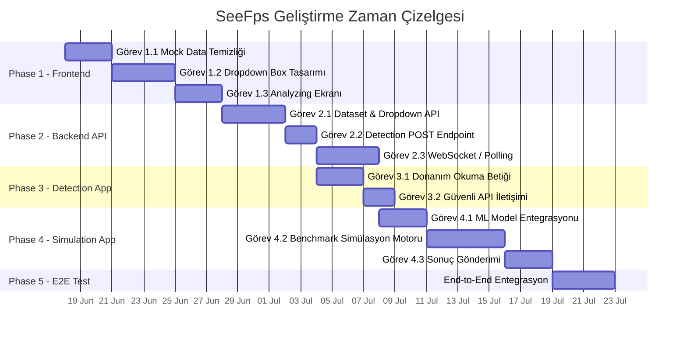

# 🗺️ SeeFps — Project Roadmap

> **End-to-End Geliştirme Yol Haritası**
> *Tüm mimari katmanlar, aşamalar ve görevler*

---

> [!CAUTION]
> **CLAUDE.md — STRICT RULE Hatırlatması:**
> AI ajanı, aşağıdaki her bir görevi (Task) tamamladığında **işlemi durduracak**,
> kullanıcıya durumu raporlayacak ve **ONAY BEKLEYECEKTİR**.
> Kullanıcı onayı olmadan asla bir sonraki göreve veya faza geçilmeyecektir.
> Bu kural istisnasız tüm fazlar ve görevler için geçerlidir.

---

## 🔭 Mimari Genel Bakış

```
┌─────────────────────────────────────────────────────────────────────────┐
│                                                                         │
│    🌐 FRONTEND (Web — Lovable'dan Refactor)                             │
│    Splash • Dropdown Seçimler • Analyzing Ekranı • Sonuç Paneli         │
│                                                                         │
├────────────────────────────┬────────────────────────────────────────────┤
│                            │                                            │
│          ▲ REST API        │         ▲ WebSockets / Polling             │
│          ▼                 │         ▼                                  │
│                            │                                            │
├────────────────────────────┴────────────────────────────────────────────┤
│                                                                         │
│    ⚡ BACKEND API (FastAPI)                                              │
│    Endpoint'ler • Veri Doğrulama • Session Yönetimi • ML Proxy          │
│                                                                         │
├─────────────────────────────────────────────────────────────────────────┤
│                            │                                            │
│          ▲ POST            │         ▲ POST (Results)                   │
│          │                 │         │                                   │
│    ┌─────┴──────────┐  ┌──┴─────────┴──────────┐                       │
│    │  🔍 DETECTION  │  │  🎮 SIMULATION APP    │                       │
│    │     APP        │  │  (Masaüstü İstemci)   │                       │
│    │  (Masaüstü)    │  │  ML Model + Benchmark │                       │
│    │  HW Tarama     │  │  Sanal Ortam Koşturma │                       │
│    └────────────────┘  └───────────────────────┘                       │
│                                                                         │
└─────────────────────────────────────────────────────────────────────────┘
```

---

## 📊 İlerleme Özeti

| Faz   | Katman                          | Durum             | Görev Sayısı |
| ----- | ------------------------------- | ----------------- | ------------ |
| **1** | Frontend Refactoring            | ✅ Tamamlandı      | 3            |
| **2** | Data & Backend API Layer        | 🔲 Başlamadı       | 3            |
| **3** | Desktop Detection App           | 🔲 Başlamadı       | 2            |
| **4** | Desktop Simulation App          | 🔲 Başlamadı       | 3            |
|       |                                 | **Toplam**        | **11**       |

---

## ✅ Phase 1 — Frontend Refactoring (Web İyileştirmeleri) — TAMAMLANDI (2026-06-18)

> **Amaç:** Lovable ile üretilmiş mevcut Frontend'i, gerçek API verisi ile çalışacak,
> kullanıcı deneyimini profesyonelleştirecek ve masaüstü istemcileriyle uyumlu hale
> getirecek şekilde refactor etmek.

```
Bağımlılık: Yok — İlk başlanacak faz.
Çıktı:      Mock data'dan arınmış, API-ready, dinamik bir Frontend.
```

---

### Görev 1.1 — Mock Data Temizliği & API Bağlantı Altyapısı

> Mevcut Frontend'teki tüm sahte/statik (mock) verileri temizle.
> Dropdown Box'ları (Açılır Kutular) Backend API'den dinamik veri çekecek
> şekilde hazırla. API henüz hazır olmasa bile, fetch yapısı ve veri
> şablonları (interface/contract) kurulmuş olacak.

- [x] Mevcut koddaki tüm hardcoded / mock data noktalarını tespit et ve belgele
- [x] Her mock data noktası için hangi API endpoint'inin karşılayacağını planla
- [x] API iletişim katmanını oluştur (`apiService.ts` + `types.ts` + `useHardwareData.ts`)
- [x] Dropdown bileşenlerini dinamik veri yüklemesine hazırla (loading state dahil)
- [x] Mock data kalıntılarının tamamen silindiğini doğrula (`data.ts` silindi)

**✅ TAMAMLANDI — 2026-06-18**

---

### Görev 1.2 — Dropdown Selection Box Tasarımına Geçiş

> Mevcut Slider / Sürükleme tabanlı seçim mekanizmalarını iptal et.
> CPU, GPU, RAM ve SSD için ayrı ayrı **Dropdown Selection Box**
> (Açılır Seçim Kutusu) bileşenleri tasarla ve uygula.

- [x] Mevcut slider bileşenlerini ve bağlı mantığı kaldır
- [x] **CPU Dropdown** bileşenini oluştur (arama/filtreleme destekli) → `NeonCombobox`
- [x] **GPU Dropdown** bileşenini oluştur (arama/filtreleme destekli) → `NeonCombobox`
- [x] **RAM Dropdown** bileşenini oluştur (kapasite + frekans seçimi) → `NeonCombobox`
- [x] **SSD Dropdown** bileşenini oluştur (model/tür seçimi) → `NeonCombobox`
- [x] **Çözünürlük Dropdown** bileşenini oluştur (720p, 1080p, 1440p, 4K) → `NeonCombobox`
- [x] Dropdown'ların responsive davranışını test et (mobil/tablet uyumu) → `sm:grid-cols-2`
- [x] Seçim state yönetimini merkezi hale getir (seçilen HW bilgisi → tek obje)

**✅ TAMAMLANDI — 2026-06-18**

---

### Görev 1.3 — Dinamik "Analyzing..." Bekleme Ekranı

> Masaüstündeki Simulation App çalışırken, web sitesinde kullanıcıyı
> bilgilendirecek ve bekletecek **canlı bir "Analyzing..." ekranı** kodla.
> Bu ekran, benchmark ilerlemesini göstermeli ve kullanıcının sayfayı
> terk etmesini önlemelidir.

- [x] "Analyzing..." overlay/modal bileşenini tasarla (animasyonlu) → `AnalyzingScreen.tsx`
- [x] İlerleme göstergesi (progress bar veya aşama gösterimi) ekle
- [x] Benchmark aşama metinleri: "Ortam kuruluyor...", "GPU yük testi...", "Sonuçlar hesaplanıyor..." vb. (12 aşama)
- [x] WebSocket veya Polling ile Backend'den durum güncellemesi alma yapısını hazırla → `useSimulationStatus.ts`
- [x] Tamamlanma durumunda otomatik olarak Results ekranına geçiş
- [x] Hata / timeout durumunda kullanıcıya anlamlı mesaj gösterimi
- [x] Kullanıcının yanlışlıkla sayfayı kapatmasını önle (`beforeunload` event)

**✅ TAMAMLANDI — 2026-06-18**

---

## 🔵 Phase 2 — Data & Backend API Layer (Veri ve Sunucu)

> **Amaç:** FastAPI tabanlı Backend'i kurmak; Frontend Dropdown'larını besleyecek,
> Detection App verilerini alacak ve Simulation App sonuçlarını yönetecek tüm
> endpoint ve altyapıyı oluşturmak.

```
Bağımlılık: Phase 1'in tamamlanmış olması tercih edilir ancak
            API kontratları tanımlandıysa paralel başlanabilir.
Çıktı:      Çalışan FastAPI sunucusu + tüm endpoint'ler + veri entegrasyonu.
```

> [!WARNING]
> **Dosya İsimlendirme Kısıtlaması:**
> Projede halihazırda `TrainedData/main.py` (veri temizleme betiği) bulunmaktadır.
> FastAPI giriş noktası **`server.py`** olarak adlandırılacaktır — çakışmayı önlemek için.
> ML tahmin motoru `TrainedData/predict_fps.py` dosyasında yer alır ve backend'e
> **import edilerek** kullanılacaktır.

---

### Görev 2.1 — Dataset Entegrasyonu & Dropdown API Endpoint'leri

> Eğitilmiş dataset'i Backend'e entegre et. Frontend'teki Dropdown
> kutularını dolduracak CPU, GPU, RAM, SSD ve oyun listesi endpoint'lerini yaz.
>
> **Veri Kaynağı Kuralı:** Dropdown listeleri, `predict_fps.py` dosyasındaki
> kategorik kolon tanımlarına (`ORDINAL_COLS`, `ONEHOT_COLS`) ve bu dosyanın
> kullandığı nihai temizlenmiş dataset yapısına (`load_and_prepare_data()`
> fonksiyonunun çıktısı) uygun olarak çekilecektir. Ham CSV'den rastgele
> unique değer çekmek YETERSİZDİR — modelin tanıdığı encoding yapısıyla
> tutarlılık ZORUNLUDUR.

- [x] FastAPI proje iskeleti oluştur (**`server.py`** ← ana giriş noktası, `main.py` DEĞİL), router'lar, config
- [x] `predict_fps.py`'yi analiz et: `ORDINAL_COLS`, `ONEHOT_COLS`, `HIGH_CARDINALITY_DROP` listelerini ve `load_and_prepare_data()` fonksiyonunun çıktı şemasını belgele
- [x] Veri servisi (`data_service.py`) oluştur: `predict_fps.py`'nin `load_and_prepare_data()` fonksiyonunu import ederek temizlenmiş dataset'ten dropdown değerlerini çek
- [x] `GET /api/hardware/cpus` → CPU listesi endpoint'i (19 CPU) ✅
- [x] `GET /api/hardware/gpus` → GPU listesi endpoint'i (27 GPU) ✅
- [x] `GET /api/hardware/rams` → RAM seçenekleri endpoint'i (7 seçenek) ✅
- [x] `GET /api/hardware/ssds` → SSD seçenekleri endpoint'i (6 seçenek) ✅
- [x] `GET /api/games` → Oyun listesi endpoint'i (24 oyun, engine + maps dahil) ✅
- [x] `GET /api/games/{game_id}/maps` → Oyuna ait harita listesi endpoint'i ✅
- [x] `GET /api/resolutions` → Desteklenen çözünürlükler endpoint'i ✅
- [x] Pydantic response modelleri oluştur (`schemas.py`)
- [x] CORS middleware yapılandır (Frontend origin'leri)
- [x] Uvicorn başlatma komutu: `uvicorn server:app --reload --port 8000`
- [x] Tüm endpoint'leri curl ile doğrula (7/7 endpoint başarılı)

**✅ TAMAMLANDI — 2026-06-23**

---

### Görev 2.2 — Detection App POST Endpoint'i

> Detection App'ten gelecek donanım verilerini (CPU ID, GPU ID, RAM, SSD)
> karşılayacak, doğrulayacak ve kullanıcının session'ına bağlayacak POST
> endpoint'ini yaz.

- [ ] `POST /api/detect` endpoint'i oluştur
- [ ] Pydantic request modeli tanımla (`DetectionPayload`)
- [ ] Gelen donanım ID'lerini dataset'teki kayıtlarla eşleştirme (matching) mantığı
- [ ] Eşleşme bulunamazsa anlamlı hata dönüşü (hangi bileşen bulunamadı)
- [ ] Session veya token tabanlı kullanıcı tanıma yapısı (opsiyonel)
- [ ] Input validation ve sanitization
- [ ] Endpoint'i Postman / curl ile test et

**🛑 DURMA NOKTASI — Kullanıcıya rapor ver ve onay bekle.**

---

### Görev 2.3 — Simulation Sonuçları: WebSocket / Polling Altyapısı & ML Entegrasyonu

> Simulation App'ten gelecek FPS, RPM, sıcaklık sonuçlarını Backend'e alacak
> ve Frontend'e gerçek zamanlı (veya yakın-gerçek zamanlı) iletecek yapıyı kur.
>
> **ML Entegrasyon Kuralı:** `server.py` içinde tahmin motoru olarak
> `predict_fps.py`'deki `tahmin_et()` fonksiyonu ve/veya `load_model()`
> fonksiyonu **import edilerek** kullanılacaktır. ML inference mantığı
> yeniden yazılmayacak, mevcut üretim modülü doğrudan çağrılacaktır.

- [ ] İletişim modelini belirle: **WebSocket** vs **SSE** vs **Long Polling** (kullanıcıya öneri sun)
- [ ] `POST /api/simulation/results` → Simulation App'ten sonuç alma endpoint'i
- [ ] `WS /ws/simulation/{session_id}` → Frontend'e canlı durum akışı (veya polling endpoint)
- [ ] `predict_fps.py`'den `tahmin_et()` ve `load_model()` fonksiyonlarını `server.py`'ye import et
- [ ] ML inference servis katmanı (`ml_service.py`): `predict_fps.py` fonksiyonlarını wrap eden adapter oluştur
- [ ] Benchmark ilerleme durumu yönetimi (states: `pending`, `running`, `stage_X`, `completed`, `error`)
- [ ] Gelen sonuç verisini doğrula ve yapılandır (FPS, sıcaklık, RPM, clock hızları)
- [ ] Frontend'in "Analyzing..." ekranına beslenecek durum mesajları formatı
- [ ] Tamamlanan sonuçları Frontend'e iletme (response veya push)
- [ ] Hata ve timeout senaryolarını yönet
- [ ] End-to-end akışı simüle ederek test et

**🛑 DURMA NOKTASI — Kullanıcıya rapor ver ve onay bekle.**

---

## 🟢 Phase 3 — Desktop Detection App (Donanım Tarama İstemcisi)

> **Amaç:** Kullanıcının makinesinde çalışarak CPU, GPU, RAM ve SSD bilgilerini
> otomatik olarak okuyacak ve Backend API'ye güvenli şekilde gönderecek hafif
> bir masaüstü uygulaması geliştirmek.

```
Bağımlılık: Phase 2 — Görev 2.2 (POST endpoint'i hazır olmalı).
Çıktı:      Çalıştırılabilir masaüstü uygulaması + API entegrasyonu.
```

---

### Görev 3.1 — Donanım Okuma Betiği

> Kullanıcının sisteminden CPU, GPU, RAM ve SSD donanım bilgilerini
> (model adı, ID, kapasite, frekans vb.) okuyan betiği yaz.

- [ ] Teknoloji kararı: Python (psutil + GPUtil + cpuinfo) veya Electron / C# (kullanıcıdan onay al)
- [ ] **CPU bilgisi** okuma: model adı, çekirdek sayısı, frekans, cache boyutları
- [ ] **GPU bilgisi** okuma: model adı, VRAM, driver versiyonu, mimari
- [ ] **RAM bilgisi** okuma: toplam kapasite, frekans, tür (DDR4/DDR5)
- [ ] **SSD/Depolama** bilgisi okuma: model adı, kapasite, tür (NVMe/SATA)
- [ ] **Ekran çözünürlüğü** okuma: aktif monitörün çözünürlüğü
- [ ] Okunan verileri Backend API'nin beklediği JSON formatına dönüştür
- [ ] Farklı işletim sistemlerinde test et (Windows öncelikli, macOS/Linux opsiyonel)
- [ ] Hata yönetimi: okunamayan bileşenler için graceful fallback

**🛑 DURMA NOKTASI — Kullanıcıya rapor ver ve onay bekle.**

---

### Görev 3.2 — Güvenli API İletişimi

> Detection App'in topladığı donanım verisini Backend API'ye güvenli
> bir şekilde göndermesini sağla.

- [ ] `POST /api/detect` endpoint'ine HTTP request gönderme mantığı
- [ ] HTTPS üzerinden iletişim (SSL/TLS)
- [ ] Gönderim öncesi veri doğrulama (eksik alan kontrolü)
- [ ] API yanıtını kullanıcıya göster (başarılı eşleşme veya hata)
- [ ] Bağlantı hatası durumunda retry mekanizması
- [ ] Kullanıcı dostu arayüz: "Taranıyor..." → "Gönderiliyor..." → "Tamamlandı ✅"
- [ ] Uygulama loglarını dosyaya yaz (debug için)
- [ ] Kullanıcıya "Web sitesine dön" yönlendirmesi

**🛑 DURMA NOKTASI — Kullanıcıya rapor ver ve onay bekle.**

---

## 🔴 Phase 4 — Desktop Simulation App (Simülasyon İstemcisi)

> **Amaç:** Kullanıcının masaüstüne indirilen, seçilen oyun ve harita için
> arka planda sanal bir benchmark simülasyonu çalıştıran ve sonuçları
> web sitesine geri yükleyen masaüstü uygulamasını geliştirmek.

```
Bağımlılık: Phase 2 — Görev 2.3 (WebSocket/Polling altyapısı hazır olmalı).
            Phase 3 tamamlanmış olması tercih edilir (ortak altyapı paylaşımı).
Çıktı:      Masaüstünde benchmark koşturan + sonuçları web'e yükleyen uygulama.
```

---

### Görev 4.1 — ML Model Entegrasyonu

> ML modelini (`seefps_model.joblib`) Simulation App'e entegre et veya
> Backend API üzerinden çağıracak yapıyı kur.
>
> **Önemli:** Tahmin motoru `predict_fps.py` içindeki `tahmin_et()` fonksiyonudur.
> Bu fonksiyon; CPU ismi, GPU ismi, oyun adı, çözünürlük ve ayar parametrelerini
> alarak model pipeline'ını (feature engineering + preprocessing + inference)
> otomatik çalıştırır. Tekerleği yeniden icat etmeye GEREK YOKTUR.

- [ ] Entegrasyon modelini belirle (kullanıcıya öneri sun):
  - **Seçenek A — Offline:** `predict_fps.py`'yi Simulation App'e dahil et, `tahmin_et()` fonksiyonunu doğrudan çağır (`from predict_fps import tahmin_et, load_model`)
  - **Seçenek B — Online:** Backend `server.py`'deki ML endpoint'ini çağır (`POST /api/predict`), burada da aynı `tahmin_et()` import edilerek kullanılır
- [ ] Seçilen yönteme göre model yükleme / API çağrı katmanını oluştur
- [ ] `predict_fps.py`'deki `feature_engineering()`, `load_and_prepare_data()` ve preprocessing pipeline'ını adapter pattern ile entegre et
- [ ] `predict_fps.py`'deki `_get_hardware_row()` fonksiyonunun dataset eşleştirme mantığını kullan
- [ ] Donanım + oyun + harita bilgilerini `tahmin_et()` fonksiyonunun beklediği parametre formatına dönüştür
- [ ] Tahmin çıktısını doğrulama: beklenen aralıkta mı? (sanity check)
- [ ] Birim testi: bilinen girdi → bilinen çıktı eşleşmesi (notebook'taki test case'lerle karşılaştır)

**🛑 DURMA NOKTASI — Kullanıcıya rapor ver ve onay bekle.**

---

### Görev 4.2 — Sanal Benchmark Simülasyon Motoru

> Masaüstünde arka planda çalışacak sanal benchmark mantığını oluştur.
> Bu motor, oyun motoru dinamiklerini (smoke, molotov, yansımalar,
> partikül efektleri vb.) mantıksal yük faktörleri olarak modelleyecek
> ve ML tahminlerini buna göre modüle edecek.

- [ ] Oyun motoru dinamikleri yük tablosunu tanımla:
  - Smoke / partikül efektleri → GPU yük çarpanı
  - Yansımalar (reflections) → GPU yük çarpanı
  - Gölge kalitesi (shadows) → GPU yük çarpanı
  - Fizik simülasyonu → CPU yük çarpanı
  - Harita karmaşıklığı → genel yük çarpanı
- [ ] Benchmark aşama sırasını oluştur (sahneler):
  - Sahne 1: Idle / menu — baseline FPS
  - Sahne 2: Normal gameplay — ortalama yük
  - Sahne 3: Yoğun efektler — pik yük (smoke + yetenekler + partikül)
  - Sahne 4: Stres testi — maksimum yük senaryosu
- [ ] Her sahne için ML tahminini yük faktörleriyle modüle eden hesaplama motoru
- [ ] Simülasyon ilerleme durumunu Backend'e raporlama (aşama bilgisi)
- [ ] Sıcaklık, RPM ve Clock hızı tahmin fonksiyonlarını oluştur (FPS'e dayalı heuristik)
- [ ] Toplam simülasyon süresini makul tut (30-60 saniye arası hedef)

**🛑 DURMA NOKTASI — Kullanıcıya rapor ver ve onay bekle.**

---

### Görev 4.3 — Sonuçların Web Sitesine Gönderimi

> Benchmark tamamlandığında oluşan sonuç datasını (Results) Backend
> API üzerinden web sitesine gönder ve Frontend'de Results ekranında
> gösterilmesini sağla.

- [ ] Sonuç veri yapısını oluştur:
  ```json
  {
    "session_id": "...",
    "avg_fps": 144.5,
    "max_fps": 180.2,
    "min_fps": 98.7,
    "fps_timeline": [120, 135, 144, ...],
    "cpu_temp_avg": 72,
    "gpu_temp_avg": 68,
    "cpu_clock_avg": 4200,
    "gpu_clock_avg": 1800,
    "fan_rpm_avg": 1450,
    "bottleneck": "GPU",
    "benchmark_duration_sec": 45,
    "stages": [...]
  }
  ```
- [ ] `POST /api/simulation/results` endpoint'ine sonuçları gönder
- [ ] Gönderim durumunu kullanıcıya göster: "Sonuçlar yükleniyor..." → "Başarıyla gönderildi ✅"
- [ ] Frontend'in sonuçları alıp Results ekranında gösterdiğini doğrula
- [ ] Gönderim başarısızlığında retry + offline kaydetme mekanizması
- [ ] End-to-End akış testi: Simulation App → Backend → Frontend Results

**🛑 DURMA NOKTASI — Kullanıcıya rapor ver ve onay bekle.**

---

## 🏁 Phase 5 — End-to-End Entegrasyon & Test *(Tüm Fazlar Tamamlandıktan Sonra)*

> **Amaç:** Tüm katmanları birbirine bağla, uçtan uca akışı doğrula.

- [ ] Frontend → Backend API bağlantı testi (Dropdown'lar dolduruluyor mu?)
- [ ] Detection App → Backend → Frontend akış testi (donanım bilgisi geliyor mu?)
- [ ] Simulation App → Backend → Frontend akış testi (sonuçlar görünüyor mu?)
- [ ] Hata senaryoları testi (API down, timeout, geçersiz veri)
- [ ] Performans testi (eşzamanlı kullanıcı senaryosu)
- [ ] Kullanıcı deneyimi (UX) son gözden geçirme
- [ ] Deployment hazırlığı (ortam değişkenleri, production config)

---

## 📅 Zaman Çizelgesi (Tahmini)



> [!NOTE]
> Yukarıdaki zaman çizelgesi **tahminidir** ve kullanıcının onay hızına,
> teknik kararlara ve revizyon ihtiyaçlarına göre değişebilir.

---

## 📌 Önemli Notlar

1. **Her görev bağımsız bir onay noktasıdır.** AI ajanı hiçbir görevi sessizce atlayamaz.
2. **Faz sıralaması esnektir.** Kullanıcı farklı bir sıralama talep ederse uyulur.
3. **Teknoloji kararları kullanıcıya aittir.** AI önerir, kullanıcı karar verir.
4. **`TrainedData/` klasörü salt okunurdur.** Wrapper/adapter pattern kullanılır.
5. **Bu dosya yaşayan bir belgedir.** Her faz tamamlandığında güncellenir.
6. **FastAPI giriş noktası `server.py`'dir, `main.py` DEĞİLDİR.** `TrainedData/main.py` veri temizleme betiğidir; karıştırılmamalıdır.
7. **ML tahmin motoru `predict_fps.py`'dir.** Tüm inference işlemleri bu dosyadaki `tahmin_et()` fonksiyonu üzerinden yapılır. Yeniden yazılmaz, import edilir.

---

> **Son Güncelleme:** 2026-06-17
> **Versiyon:** 1.1.0
