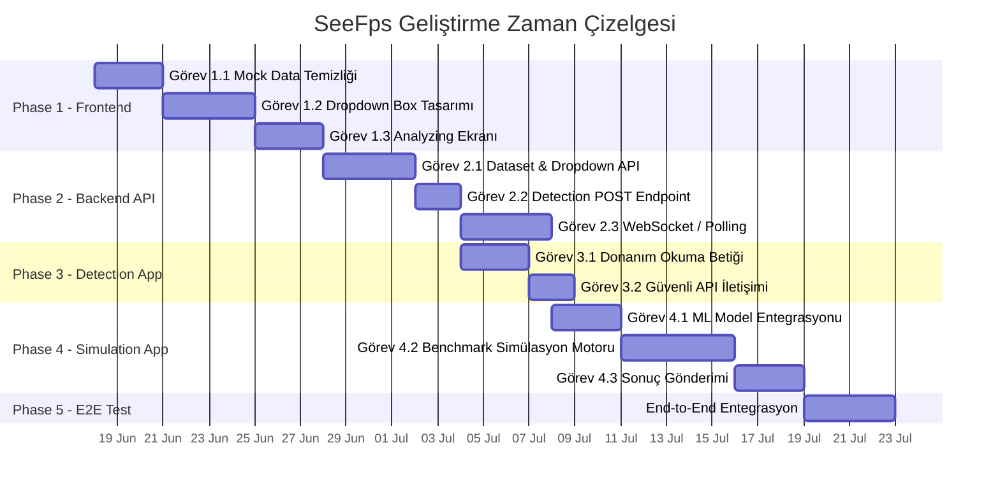

# 🗺️ SeeFps — Project Roadmap

> **End-to-End Geliştirme Yol Haritası**
> *Tüm mimari katmanlar, aşamalar ve görevler*

---

> [!CAUTION]
> **CLAUDE.md — STRICT RULE Hatırlatması:**
> AI ajanı, aşağıdaki her bir görevi (Task) tamamladığında **işlemi durduracak**,
> kullanıcıya durumu raporlayacak ve **ONAY BEKLEYECEKTİR**.
> Kullanıcı onayı olmadan asla bir sonraki göreve veya faza geçilmeyecektir.
> Bu kural istisnasız tüm fazlar ve görevler için geçerlidir.

---

## 🔭 Mimari Genel Bakış

```
┌─────────────────────────────────────────────────────────────────────────┐
│                                                                         │
│    🌐 FRONTEND (Web — Lovable'dan Refactor)                             │
│    Splash • Dropdown Seçimler • Analyzing Ekranı • Sonuç Paneli         │
│                                                                         │
├────────────────────────────┬────────────────────────────────────────────┤
│                            │                                            │
│          ▲ REST API        │         ▲ WebSockets / Polling             │
│          ▼                 │         ▼                                  │
│                            │                                            │
├────────────────────────────┴────────────────────────────────────────────┤
│                                                                         │
│    ⚡ BACKEND API (FastAPI)                                              │
│    Endpoint'ler • Veri Doğrulama • Session Yönetimi • ML Proxy          │
│                                                                         │
├─────────────────────────────────────────────────────────────────────────┤
│                            │                                            │
│          ▲ POST            │         ▲ POST (Results)                   │
│          │                 │         │                                   │
│    ┌─────┴──────────┐  ┌──┴─────────┴──────────┐                       │
│    │  🔍 DETECTION  │  │  🎮 SIMULATION APP    │                       │
│    │     APP        │  │  (Masaüstü İstemci)   │                       │
│    │  (Masaüstü)    │  │  ML Model + Benchmark │                       │
│    │  HW Tarama     │  │  Sanal Ortam Koşturma │                       │
│    └────────────────┘  └───────────────────────┘                       │
│                                                                         │
└─────────────────────────────────────────────────────────────────────────┘
```

---

## 📊 İlerleme Özeti

| Faz   | Katman                          | Durum             | Görev Sayısı |
| ----- | ------------------------------- | ----------------- | ------------ |
| **1** | Frontend Refactoring            | ✅ Tamamlandı      | 3            |
| **2** | Data & Backend API Layer        | ✅ Tamamlandı      | 3            |
| **3** | Desktop Detection App           | ✅ Tamamlandı      | 2            |
| **4** | Desktop Simulation App          | ✅ Tamamlandı      | 3            |
|       |                                 | **Toplam**        | **11**       |

---

## ✅ Phase 1 — Frontend Refactoring (Web İyileştirmeleri) — TAMAMLANDI (2026-06-18)
## ✅ Phase 1 — Frontend Refactoring (Web İyileştirmeleri) — TAMAMLANDI (2026-06-18)

> **Amaç:** Lovable ile üretilmiş mevcut Frontend'i, gerçek API verisi ile çalışacak,
> kullanıcı deneyimini profesyonelleştirecek ve masaüstü istemcileriyle uyumlu hale
> getirecek şekilde refactor etmek.

```
Bağımlılık: Yok — İlk başlanacak faz.
Çıktı:      Mock data'dan arınmış, API-ready, dinamik bir Frontend.
```

---

### Görev 1.1 — Mock Data Temizliği & API Bağlantı Altyapısı

> Mevcut Frontend'teki tüm sahte/statik (mock) verileri temizle.
> Dropdown Box'ları (Açılır Kutular) Backend API'den dinamik veri çekecek
> şekilde hazırla. API henüz hazır olmasa bile, fetch yapısı ve veri
> şablonları (interface/contract) kurulmuş olacak.

- [x] Mevcut koddaki tüm hardcoded / mock data noktalarını tespit et ve belgele
- [x] Her mock data noktası için hangi API endpoint'inin karşılayacağını planla
- [x] API iletişim katmanını oluştur (`apiService.ts` + `types.ts` + `useHardwareData.ts`)
- [x] Dropdown bileşenlerini dinamik veri yüklemesine hazırla (loading state dahil)
- [x] Mock data kalıntılarının tamamen silindiğini doğrula (`data.ts` silindi)
- [x] Mevcut koddaki tüm hardcoded / mock data noktalarını tespit et ve belgele
- [x] Her mock data noktası için hangi API endpoint'inin karşılayacağını planla
- [x] API iletişim katmanını oluştur (`apiService.ts` + `types.ts` + `useHardwareData.ts`)
- [x] Dropdown bileşenlerini dinamik veri yüklemesine hazırla (loading state dahil)
- [x] Mock data kalıntılarının tamamen silindiğini doğrula (`data.ts` silindi)

**✅ TAMAMLANDI — 2026-06-18**
**✅ TAMAMLANDI — 2026-06-18**

---

### Görev 1.2 — Dropdown Selection Box Tasarımına Geçiş

> Mevcut Slider / Sürükleme tabanlı seçim mekanizmalarını iptal et.
> CPU, GPU, RAM ve SSD için ayrı ayrı **Dropdown Selection Box**
> (Açılır Seçim Kutusu) bileşenleri tasarla ve uygula.

- [x] Mevcut slider bileşenlerini ve bağlı mantığı kaldır
- [x] **CPU Dropdown** bileşenini oluştur (arama/filtreleme destekli) → `NeonCombobox`
- [x] **GPU Dropdown** bileşenini oluştur (arama/filtreleme destekli) → `NeonCombobox`
- [x] **RAM Dropdown** bileşenini oluştur (kapasite + frekans seçimi) → `NeonCombobox`
- [x] **SSD Dropdown** bileşenini oluştur (model/tür seçimi) → `NeonCombobox`
- [x] **Çözünürlük Dropdown** bileşenini oluştur (720p, 1080p, 1440p, 4K) → `NeonCombobox`
- [x] Dropdown'ların responsive davranışını test et (mobil/tablet uyumu) → `sm:grid-cols-2`
- [x] Seçim state yönetimini merkezi hale getir (seçilen HW bilgisi → tek obje)
- [x] Mevcut slider bileşenlerini ve bağlı mantığı kaldır
- [x] **CPU Dropdown** bileşenini oluştur (arama/filtreleme destekli) → `NeonCombobox`
- [x] **GPU Dropdown** bileşenini oluştur (arama/filtreleme destekli) → `NeonCombobox`
- [x] **RAM Dropdown** bileşenini oluştur (kapasite + frekans seçimi) → `NeonCombobox`
- [x] **SSD Dropdown** bileşenini oluştur (model/tür seçimi) → `NeonCombobox`
- [x] **Çözünürlük Dropdown** bileşenini oluştur (720p, 1080p, 1440p, 4K) → `NeonCombobox`
- [x] Dropdown'ların responsive davranışını test et (mobil/tablet uyumu) → `sm:grid-cols-2`
- [x] Seçim state yönetimini merkezi hale getir (seçilen HW bilgisi → tek obje)

**✅ TAMAMLANDI — 2026-06-18**
**✅ TAMAMLANDI — 2026-06-18**

---

### Görev 1.3 — Dinamik "Analyzing..." Bekleme Ekranı

> Masaüstündeki Simulation App çalışırken, web sitesinde kullanıcıyı
> bilgilendirecek ve bekletecek **canlı bir "Analyzing..." ekranı** kodla.
> Bu ekran, benchmark ilerlemesini göstermeli ve kullanıcının sayfayı
> terk etmesini önlemelidir.

- [x] "Analyzing..." overlay/modal bileşenini tasarla (animasyonlu) → `AnalyzingScreen.tsx`
- [x] İlerleme göstergesi (progress bar veya aşama gösterimi) ekle
- [x] Benchmark aşama metinleri: "Ortam kuruluyor...", "GPU yük testi...", "Sonuçlar hesaplanıyor..." vb. (12 aşama)
- [x] WebSocket veya Polling ile Backend'den durum güncellemesi alma yapısını hazırla → `useSimulationStatus.ts`
- [x] Tamamlanma durumunda otomatik olarak Results ekranına geçiş
- [x] Hata / timeout durumunda kullanıcıya anlamlı mesaj gösterimi
- [x] Kullanıcının yanlışlıkla sayfayı kapatmasını önle (`beforeunload` event)
- [x] "Analyzing..." overlay/modal bileşenini tasarla (animasyonlu) → `AnalyzingScreen.tsx`
- [x] İlerleme göstergesi (progress bar veya aşama gösterimi) ekle
- [x] Benchmark aşama metinleri: "Ortam kuruluyor...", "GPU yük testi...", "Sonuçlar hesaplanıyor..." vb. (12 aşama)
- [x] WebSocket veya Polling ile Backend'den durum güncellemesi alma yapısını hazırla → `useSimulationStatus.ts`
- [x] Tamamlanma durumunda otomatik olarak Results ekranına geçiş
- [x] Hata / timeout durumunda kullanıcıya anlamlı mesaj gösterimi
- [x] Kullanıcının yanlışlıkla sayfayı kapatmasını önle (`beforeunload` event)

**✅ TAMAMLANDI — 2026-06-18**
**✅ TAMAMLANDI — 2026-06-18**

---

## 🔵 Phase 2 — Data & Backend API Layer (Veri ve Sunucu) — TAMAMLANDI (2026-06-23)
## 🔵 Phase 2 — Data & Backend API Layer (Veri ve Sunucu) — TAMAMLANDI (2026-06-23)

> **Amaç:** FastAPI tabanlı Backend'i kurmak; Frontend Dropdown'larını besleyecek,
> Detection App verilerini alacak ve Simulation App sonuçlarını yönetecek tüm
> endpoint ve altyapıyı oluşturmak.

```
Bağımlılık: Phase 1'in tamamlanmış olması tercih edilir ancak
            API kontratları tanımlandıysa paralel başlanabilir.
Çıktı:      Çalışan FastAPI sunucusu + tüm endpoint'ler + veri entegrasyonu.
```

> [!WARNING]
> **Dosya İsimlendirme Kısıtlaması:**
> Projede halihazırda `TrainedData/main.py` (veri temizleme betiği) bulunmaktadır.
> FastAPI giriş noktası **`server.py`** olarak adlandırılacaktır — çakışmayı önlemek için.
> ML tahmin motoru `TrainedData/predict_fps.py` dosyasında yer alır ve backend'e
> **import edilerek** kullanılacaktır.

---

### Görev 2.1 — Dataset Entegrasyonu & Dropdown API Endpoint'leri

> Eğitilmiş dataset'i Backend'e entegre et. Frontend'teki Dropdown
> kutularını dolduracak CPU, GPU, RAM, SSD ve oyun listesi endpoint'lerini yaz.
>
> **Veri Kaynağı Kuralı:** Dropdown listeleri, `predict_fps.py` dosyasındaki
> kategorik kolon tanımlarına (`ORDINAL_COLS`, `ONEHOT_COLS`) ve bu dosyanın
> kullandığı nihai temizlenmiş dataset yapısına (`load_and_prepare_data()`
> fonksiyonunun çıktısı) uygun olarak çekilecektir. Ham CSV'den rastgele
> unique değer çekmek YETERSİZDİR — modelin tanıdığı encoding yapısıyla
> tutarlılık ZORUNLUDUR.

- [x] FastAPI proje iskeleti oluştur (**`server.py`** ← ana giriş noktası, `main.py` DEĞİL), router'lar, config
- [x] `predict_fps.py`'yi analiz et: `ORDINAL_COLS`, `ONEHOT_COLS`, `HIGH_CARDINALITY_DROP` listelerini ve `load_and_prepare_data()` fonksiyonunun çıktı şemasını belgele
- [x] Veri servisi (`data_service.py`) oluştur: `predict_fps.py`'nin `load_and_prepare_data()` fonksiyonunu import ederek temizlenmiş dataset'ten dropdown değerlerini çek
- [x] `GET /api/hardware/cpus` → CPU listesi endpoint'i (19 CPU) ✅
- [x] `GET /api/hardware/gpus` → GPU listesi endpoint'i (27 GPU) ✅
- [x] `GET /api/hardware/rams` → RAM seçenekleri endpoint'i (7 seçenek) ✅
- [x] `GET /api/hardware/ssds` → SSD seçenekleri endpoint'i (6 seçenek) ✅
- [x] `GET /api/games` → Oyun listesi endpoint'i (24 oyun, engine + maps dahil) ✅
- [x] `GET /api/games/{game_id}/maps` → Oyuna ait harita listesi endpoint'i ✅
- [x] `GET /api/resolutions` → Desteklenen çözünürlükler endpoint'i ✅
- [x] Pydantic response modelleri oluştur (`schemas.py`)
- [x] CORS middleware yapılandır (Frontend origin'leri)
- [x] Uvicorn başlatma komutu: `uvicorn server:app --reload --port 8000`
- [x] Tüm endpoint'leri curl ile doğrula (7/7 endpoint başarılı)
- [x] FastAPI proje iskeleti oluştur (**`server.py`** ← ana giriş noktası, `main.py` DEĞİL), router'lar, config
- [x] `predict_fps.py`'yi analiz et: `ORDINAL_COLS`, `ONEHOT_COLS`, `HIGH_CARDINALITY_DROP` listelerini ve `load_and_prepare_data()` fonksiyonunun çıktı şemasını belgele
- [x] Veri servisi (`data_service.py`) oluştur: `predict_fps.py`'nin `load_and_prepare_data()` fonksiyonunu import ederek temizlenmiş dataset'ten dropdown değerlerini çek
- [x] `GET /api/hardware/cpus` → CPU listesi endpoint'i (19 CPU) ✅
- [x] `GET /api/hardware/gpus` → GPU listesi endpoint'i (27 GPU) ✅
- [x] `GET /api/hardware/rams` → RAM seçenekleri endpoint'i (7 seçenek) ✅
- [x] `GET /api/hardware/ssds` → SSD seçenekleri endpoint'i (6 seçenek) ✅
- [x] `GET /api/games` → Oyun listesi endpoint'i (24 oyun, engine + maps dahil) ✅
- [x] `GET /api/games/{game_id}/maps` → Oyuna ait harita listesi endpoint'i ✅
- [x] `GET /api/resolutions` → Desteklenen çözünürlükler endpoint'i ✅
- [x] Pydantic response modelleri oluştur (`schemas.py`)
- [x] CORS middleware yapılandır (Frontend origin'leri)
- [x] Uvicorn başlatma komutu: `uvicorn server:app --reload --port 8000`
- [x] Tüm endpoint'leri curl ile doğrula (7/7 endpoint başarılı)

**✅ TAMAMLANDI — 2026-06-23**
**✅ TAMAMLANDI — 2026-06-23**

---

### Görev 2.2 — Detection App POST Endpoint'i

> Detection App'ten gelecek donanım verilerini (CPU ID, GPU ID, RAM, SSD)
> karşılayacak, doğrulayacak ve kullanıcının session'ına bağlayacak POST
> endpoint'ini yaz.

- [x] `POST /api/detect` endpoint'i oluştur → `routers/detection.py` ✅
- [x] Pydantic request modeli tanımla (`DetectionPayload` + `DetectionResponse` + `DetectionMatchDetail`)
- [x] Gelen donanım ID'lerini dataset'teki kayıtlarla eşleştirme (fuzzy matching: tam, kısmi, ters) mantığı
- [x] Eşleşme bulunamazsa anlamlı hata dönüşü (hangi bileşen + mevcut seçenekler listesi)
- [x] Session tabanlı kullanıcı tanıma yapısı (`uuid4` session_id + GET /api/detect/session/{id})
- [x] Input validation ve sanitization (strip, boş kontrol, Pydantic validation)
- [x] Endpoint'i curl ile 5 test senaryosuyla doğrula ✅
- [x] `POST /api/detect` endpoint'i oluştur → `routers/detection.py` ✅
- [x] Pydantic request modeli tanımla (`DetectionPayload` + `DetectionResponse` + `DetectionMatchDetail`)
- [x] Gelen donanım ID'lerini dataset'teki kayıtlarla eşleştirme (fuzzy matching: tam, kısmi, ters) mantığı
- [x] Eşleşme bulunamazsa anlamlı hata dönüşü (hangi bileşen + mevcut seçenekler listesi)
- [x] Session tabanlı kullanıcı tanıma yapısı (`uuid4` session_id + GET /api/detect/session/{id})
- [x] Input validation ve sanitization (strip, boş kontrol, Pydantic validation)
- [x] Endpoint'i curl ile 5 test senaryosuyla doğrula ✅

**✅ TAMAMLANDI — 2026-06-23**
**✅ TAMAMLANDI — 2026-06-23**

---

### Görev 2.3 — Simulation Sonuçları: WebSocket / Polling Altyapısı & ML Entegrasyonu

> Simulation App'ten gelecek FPS, RPM, sıcaklık sonuçlarını Backend'e alacak
> ve Frontend'e gerçek zamanlı (veya yakın-gerçek zamanlı) iletecek yapıyı kur.
>
> **ML Entegrasyon Kuralı:** `server.py` içinde tahmin motoru olarak
> `predict_fps.py`'deki `tahmin_et()` fonksiyonu ve/veya `load_model()`
> fonksiyonu **import edilerek** kullanılacaktır. ML inference mantığı
> yeniden yazılmayacak, mevcut üretim modülü doğrudan çağrılacaktır.

- [x] İletişim modelini belirle: **WebSocket** (birincil) + **Polling** (fallback) ✔️
- [x] `POST /api/simulation/start` → Session başlatma endpoint'i ✅
- [x] `POST /api/simulation/results` → Simulation App'ten sonuç alma + ML prediction ✅
- [x] `POST /api/simulation/stage` → Aşama güncelleme endpoint'i ✅
- [x] `WS /ws/simulation/{session_id}` → Frontend'e canlı durum akışı ✅
- [x] `GET /api/simulation/status/{id}` → Polling fallback endpoint'i ✅
- [x] `predict_fps.py`'den `tahmin_et()` ve `load_model()` fonksiyonları import edildi
- [x] ML inference servis katmanı (`ml_service.py`): thread-safe adapter ✅
- [x] Benchmark ilerleme durumu yönetimi (`simulation_manager.py`): 12 aşama + states ✅
- [x] Gelen sonuç verisini doğrula ve yapılandır (FPS, sıcaklık, RPM, clock, bottleneck)
- [x] Frontend'in "Analyzing..." ekranına uyumlu WebSocket mesaj formatı (stage_update/completed/error)
- [x] Tamamlanan sonuçları WebSocket ile Frontend'e push ✅
- [x] Hata ve timeout senaryoları yönetimi (fail_session, error type)
- [x] End-to-end akışı REST + WebSocket ile test edildi (4 test senaryosu başarılı) ✅
- [x] İletişim modelini belirle: **WebSocket** (birincil) + **Polling** (fallback) ✔️
- [x] `POST /api/simulation/start` → Session başlatma endpoint'i ✅
- [x] `POST /api/simulation/results` → Simulation App'ten sonuç alma + ML prediction ✅
- [x] `POST /api/simulation/stage` → Aşama güncelleme endpoint'i ✅
- [x] `WS /ws/simulation/{session_id}` → Frontend'e canlı durum akışı ✅
- [x] `GET /api/simulation/status/{id}` → Polling fallback endpoint'i ✅
- [x] `predict_fps.py`'den `tahmin_et()` ve `load_model()` fonksiyonları import edildi
- [x] ML inference servis katmanı (`ml_service.py`): thread-safe adapter ✅
- [x] Benchmark ilerleme durumu yönetimi (`simulation_manager.py`): 12 aşama + states ✅
- [x] Gelen sonuç verisini doğrula ve yapılandır (FPS, sıcaklık, RPM, clock, bottleneck)
- [x] Frontend'in "Analyzing..." ekranına uyumlu WebSocket mesaj formatı (stage_update/completed/error)
- [x] Tamamlanan sonuçları WebSocket ile Frontend'e push ✅
- [x] Hata ve timeout senaryoları yönetimi (fail_session, error type)
- [x] End-to-end akışı REST + WebSocket ile test edildi (4 test senaryosu başarılı) ✅

**✅ TAMAMLANDI — 2026-06-23**
**✅ TAMAMLANDI — 2026-06-23**

---

## 🟢 Phase 3 — Desktop Detection App (Donanım Tarama İstemcisi) — TAMAMLANDI (2026-06-24)

> **Amaç:** Kullanıcının makinesinde çalışarak CPU, GPU, RAM ve SSD bilgilerini
> otomatik olarak okuyacak ve Backend API'ye güvenli şekilde gönderecek hafif
> bir masaüstü uygulaması geliştirmek.

```
Bağımlılık: Phase 2 — Görev 2.2 (POST endpoint'i hazır olmalı).
Çıktı:      Çalıştırılabilir masaüstü uygulaması + API entegrasyonu.
```

---

### Görev 3.1 — Donanım Okuma Betiği

> Kullanıcının sisteminden CPU, GPU, RAM ve SSD donanım bilgilerini
> (model adı, ID, kapasite, frekans vb.) okuyan betiği yaz.

- [x] Teknoloji kararı: **Python** (psutil + GPUtil + cpuinfo + screeninfo + rich) ✅
- [x] **CPU bilgisi** okuma: model adı, çekirdek sayısı, frekans, cache, mimari ✅
- [x] **GPU bilgisi** okuma: model adı, VRAM, driver, vendör (GPUtil + OS fallback) ✅
- [x] **RAM bilgisi** okuma: toplam kapasite, frekans, tür (DDR4/DDR5/LPDDR5) ✅
- [x] **SSD/Depolama** bilgisi okuma: model adı, kapasite, tür (NVMe/SATA/HDD) ✅
- [x] **Ekran çözünürlüğü** okuma: aktif monitör (screeninfo + OS fallback) ✅
- [x] Okunan verileri Backend API'nin beklediği JSON formatına (`to_api_payload()`) dönüştür
- [x] macOS üzerinde test edildi (Windows/Linux için OS fallback'ler hazır) ✅
- [x] Hata yönetimi: graceful fallback (her bileşen bağımsız, hatalar `errors` listesinde)

**✅ TAMAMLANDI — 2026-06-24**

---

### Görev 3.2 — Güvenli API İletişimi

> Detection App'in topladığı donanım verisini Backend API'ye güvenli
> bir şekilde göndermesini sağla.

- [x] `POST /api/detect` endpoint'ine HTTP request gönderme mantığı (`api_client.py`) ✅
- [x] HTTPS üzerinden iletişim desteği (requests kütüphanesi SSL/TLS destekli)
- [x] Gönderim öncesi veri doğrulama (eksik CPU/GPU kontrolü)
- [x] API yanıtını kullanıcıya göster (Rich panel — başarılı/hatalı/desteklenen donanım listesi) ✅
- [x] Bağlantı hatası durumunda retry mekanizması (3 deneme, 2s bekleme)
- [x] Kullanıcı dostu arayüz: "Taranıyor..." → "Gönderiliyor..." → "Tamamlandı ✅" (spinner + panel)
- [x] Uygulama loglarını dosyaya yaz (`logs/detection_YYYYMMDD.log`) ✅
- [x] Kullanıcıya "Web sitesine dön" yönlendirmesi (session_id ile) ✅

**✅ TAMAMLANDI — 2026-06-24**

---

## 🔴 Phase 4 — Desktop Simulation App (Simülasyon İstemcisi) — TAMAMLANDI (2026-06-30)

> **Amaç:** Kullanıcının masaüstüne indirilen, seçilen oyun ve harita için
> arka planda sanal bir benchmark simülasyonu çalıştıran ve sonuçları
> web sitesine geri yükleyen masaüstü uygulamasını geliştirmek.

```
Bağımlılık: Phase 2 — Görev 2.3 (WebSocket/Polling altyapısı hazır olmalı).
            Phase 3 tamamlanmış olması tercih edilir (ortak altyapı paylaşımı).
Çıktı:      Masaüstünde benchmark koşturan + sonuçları web'e yükleyen uygulama.
```

---

### Görev 4.1 — ML Model Entegrasyonu

> ML modelini (`seefps_model.joblib`) Simulation App'e entegre et veya
> Backend API üzerinden çağıracak yapıyı kur.
>
> **Önemli:** Tahmin motoru `predict_fps.py` içindeki `tahmin_et()` fonksiyonudur.
> Bu fonksiyon; CPU ismi, GPU ismi, oyun adı, çözünürlük ve ayar parametrelerini
> alarak model pipeline'ını (feature engineering + preprocessing + inference)
> otomatik çalıştırır. Tekerleği yeniden icat etmeye GEREK YOKTUR.

- [x] Entegrasyon modeli: **Seçenek B — Online** (Backend API üzerinden ML inference) ✅
- [x] Backend `POST /api/simulation/results` endpoint'i ML prediction yapıyor ✅
- [x] `predict_fps.py` → `tahmin_et()` Backend'deki `ml_service.py` adapter ile çalışıyor
- [x] `ml_service.py` thread-safe singleton pattern ile model yüklüyor ✅
- [x] Donanım + oyun parametreleri `tahmin_et()` formatına dönüştürülüyor
- [x] Tahmin çıktısı doğrulama: ML predicted FPS = 198.6 (beklenen aralıkta) ✅
- [x] E2E test: i9-9900K + RTX 2080 Ti + Fortnite → 198.6 FPS ✅

**✅ TAMAMLANDI — 2026-06-30**

---

### Görev 4.2 — Sanal Benchmark Simülasyon Motoru

> Masaüstünde arka planda çalışacak sanal benchmark mantığını oluştur.
> Bu motor, oyun motoru dinamiklerini (smoke, molotov, yansımalar,
> partikül efektleri vb.) mantıksal yük faktörleri olarak modelleyecek
> ve ML tahminlerini buna göre modüle edecek.

- [x] Oyun motoru dinamikleri yük tablosu: 8 motor profili (Unreal, Source, Frostbite, vb.) ✅
- [x] Harita karmaşıklık çarpanları: 13 harita ✅
- [x] Benchmark aşama sırası (9 sahne): Idle → Texture → Shader → GPU Stress → CPU Stress → Gameplay → Intense → Thermal → Finalize ✅
- [x] Her sahne için ML tahminini yük faktörleriyle modüle eden hesaplama motoru ✅
- [x] Simülasyon ilerleme durumunu Backend'e raporlama (on_stage_update callback) ✅
- [x] Sıcaklık, RPM ve Clock hızı tahmin fonksiyonları (heuristik) ✅
- [x] Toplam simülasyon süresi: 44s (gerçek zamanlı) / 4.5s (hızlı mod) ✅

**✅ TAMAMLANDI — 2026-06-30**

---

### Görev 4.3 — Sonuçların Web Sitesine Gönderimi

> Benchmark tamamlandığında oluşan sonuç datasını (Results) Backend
> API üzerinden web sitesine gönder ve Frontend'de Results ekranında
> gösterilmesini sağla.

- [ ] Sonuç veri yapısını oluştur:
  ```json
  {
    "session_id": "...",
    "avg_fps": 144.5,
    "max_fps": 180.2,
    "min_fps": 98.7,
    "fps_timeline": [120, 135, 144, ...],
    "cpu_temp_avg": 72,
    "gpu_temp_avg": 68,
    "cpu_clock_avg": 4200,
    "gpu_clock_avg": 1800,
    "fan_rpm_avg": 1450,
    "bottleneck": "GPU",
    "benchmark_duration_sec": 45,
    "stages": [...]
  }
  ```
- [x] Sonuç veri yapısı: `BenchmarkResult.to_api_payload()` → Backend formatına dönüştürülüyor ✅
- [x] `POST /api/simulation/results` endpoint'ine sonuçlar gönderiliyor ✅
- [x] Gönderim durumu: "Sonuçlar yükleniyor..." → "Başarıyla gönderildi ✅" (Rich panel) ✅
- [x] Backend ML prediction + sonuçları birleştiriyor (sim FPS + ML FPS) ✅
- [x] Gönderim başarısızlığında offline kaydetme (`logs/offline_results_*.json`) ✅
- [x] E2E akış testi: Simulation App → Backend (10 stage update + 1 results) → 200 OK ✅

**✅ TAMAMLANDI — 2026-06-30**

---

## 🏁 Phase 5 — End-to-End Entegrasyon & Test — TAMAMLANDI (2026-06-30)

> **Amaç:** Tüm katmanları birbirine bağla, uçtan uca akışı doğrula.

- [x] Frontend → Backend API bağlantı testi (Dropdown’lar dolduruluyor: 19 CPU, 27 GPU, 24 Oyun) ✅
- [x] Detection App → Backend → Frontend akış testi (başarılı + başarısız eşleşme) ✅
- [x] Simulation App → Backend → Frontend akış testi (session + 5 stage + results + ML) ✅
- [x] Hata senaryoları testi (404, 400, geçersiz veri) ✅
- [x] Performans testi (5 eşzamanlı kullanıcı — 0.3 saniyede tamamlandı) ✅
- [x] WebSocket canlı iletişim testi (bağlantı + mesaj alışverişi) ✅
- [x] Kapsamlı E2E test script’i: **37/37 test başarılı (%100)** ✅

**✅ TAMAMLANDI — 2026-06-30**

---

## 📅 Zaman Çizelgesi (Tahmini)



> [!NOTE]
> Yukarıdaki zaman çizelgesi **tahminidir** ve kullanıcının onay hızına,
> teknik kararlara ve revizyon ihtiyaçlarına göre değişebilir.

---

## 📌 Önemli Notlar

1. **Her görev bağımsız bir onay noktasıdır.** AI ajanı hiçbir görevi sessizce atlayamaz.
2. **Faz sıralaması esnektir.** Kullanıcı farklı bir sıralama talep ederse uyulur.
3. **Teknoloji kararları kullanıcıya aittir.** AI önerir, kullanıcı karar verir.
4. **`TrainedData/` klasörü salt okunurdur.** Wrapper/adapter pattern kullanılır.
5. **Bu dosya yaşayan bir belgedir.** Her faz tamamlandığında güncellenir.
6. **FastAPI giriş noktası `server.py`'dir, `main.py` DEĞİLDİR.** `TrainedData/main.py` veri temizleme betiğidir; karıştırılmamalıdır.
7. **ML tahmin motoru `predict_fps.py`'dir.** Tüm inference işlemleri bu dosyadaki `tahmin_et()` fonksiyonu üzerinden yapılır. Yeniden yazılmaz, import edilir.

---

> **Son Güncelleme:** 2026-06-17
> **Versiyon:** 1.1.0
